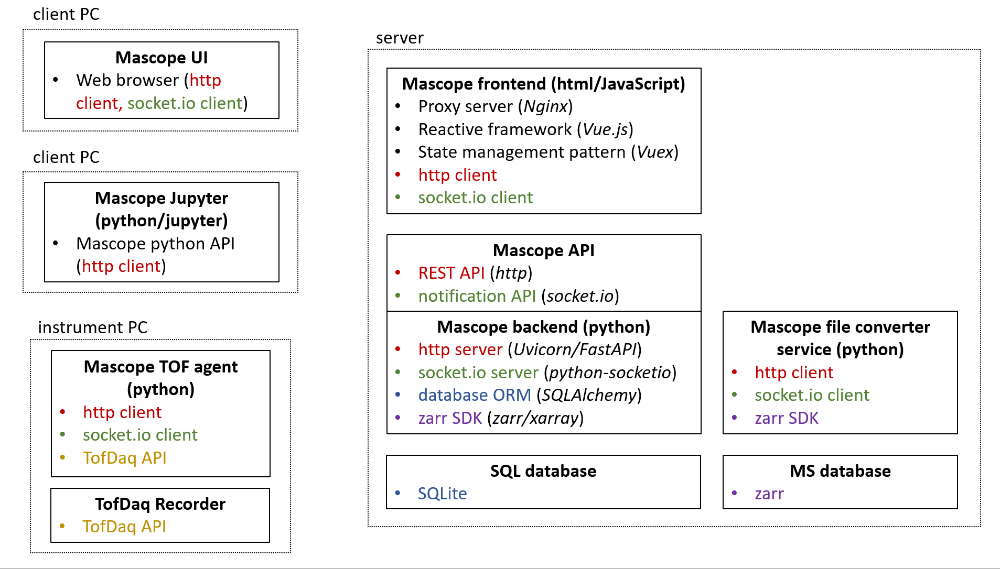

# Mascope

### Description

This monorepo contains Mascope python backend and Vue frontend, as well as peripheral "agent" applications and build/deploy scripts. For more details on these, refer to their respective READMEs.

The project is structured as follows:

```
mascope         # Project root
├───agents           # Agent applications
├───backend          # Mascope backend and related packages
├───frontend         # Mascope frontend
└───scripts          # Build and deploy scripts
```

The backend and frontend have their own setup documentation for Windows and Linux, using scripts and virtualbox. In addition to these setup methods, the frontend and backend are Dockerized; see the _Quick start with Docker_ section for more information.



### Deploy for development (Windows)

1. Install prerequisites:

   - [Python 3.10](https://www.python.org/downloads/release/python-31011/) - Python interpreter
   - [poetry](https://python-poetry.org/) - Python dependency manager
   - [Node 22](https://nodejs.org/en) - JavaScript runtime environment

2. Set up deployment environment by creating file `/scripts/deploy/dev.win/.debug_env`, with the following contents (example, note that the specified directories must exist):

```
MASCOPE_PRIVATE_DATABASE_DIR=C:/mascope_data/database
MASCOPE_PRIVATE_INSTRUMENT_DIR=C:/mascope_data/instrument
```

3. Run `/scripts/deploy/dev.win/deploy.cmd`. This will install and run the application (frontend and backend).

4. Setup Playwright for frontend tests:

```
cd ./frontend
npx playright install
```

### Build for production (Linux)

Refer to the `README.md` under `/scripts/build`.

##

### _DEPRECATED: Quick Start with Docker_

**NOTE: Containerization to be reviewed and updated**

For a quick development setup with docker:

1.  _Install_ dependencies `docker` and `docker-compose`;
2.  _Build_ with `./docker-build.sh`;
3.  _Run_ with `docker-compose up`;

The build script wraps `docker-compose build` with an extra optimization step. For additonal reference, check out the [docker-compose docs](https://docs.docker.com/compose/).
