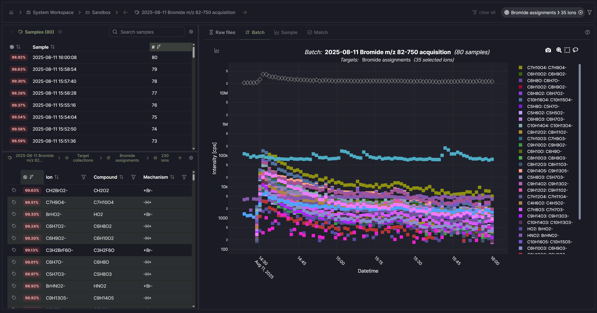

# Mascope

**A platform for analysing and storing high-resolution mass spectrometry data** - import
instrument files, browse samples and batches, run targeted matching and
calibration, and explore results in the web UI or from Python.

<picture>
  <source media="(prefers-color-scheme: light)" srcset="docs/assets/mascope-ui-light.png">
  <source media="(prefers-color-scheme: dark)" srcset="docs/assets/mascope-ui-dark.png">
  
</picture>

Mascope ingests Thermo Orbitrap (`.raw`) and Tofwerk TOF (`.h5`) data, processes it
through a peak-detection + calibration + targeted-matching pipeline, and serves
it through a multi-user web application and a Python SDK. It is built for
laboratories that need reproducible, high-throughput analysis of complex spectra.

## Try it in 5 minutes

Run Mascope on your machine with Docker (the only prerequisite):

```sh
# get docker-compose.release.yaml + .env.example from this repo, then:
cp .env.example .env

# create the secrets
mkdir -p .runtime/secrets
head -c 32 /dev/urandom | xxd -p -c 32 > .runtime/secrets/postgres_password.txt
head -c 32 /dev/urandom | xxd -p -c 32 > .runtime/secrets/jwt_secret_key.txt
head -c 32 /dev/urandom | xxd -p -c 32 > .runtime/secrets/server_owner_secret_key.txt

# pull the published images and start
docker compose -f docker-compose.release.yaml pull
docker compose -f docker-compose.release.yaml up -d

# follow the application logs (Ctrl+C just detaches; containers keep running)
docker compose -f docker-compose.release.yaml logs -f backend frontend file_converter
```

Then open <http://localhost:8080>. See
[Getting started](docs/user/getting-started/index.md) for loading the demo
dataset.

### See real data instantly

If you've cloned this repo (with [uv](https://docs.astral.sh/uv/) and Docker
running), one command fetches a published demo dataset from Zenodo and
launches Mascope preloaded with it, plus a ready-to-use login
(`demo@mascope.app` / `mascope-demo`) and SDK token, no setup:

```sh
mascope demo
```

See [Demo dataset](docs/demo_dataset.md) for what's in the bundle and the
`--rebuild` path that re-runs the full pipeline from the included raw files.

## Hosting

- **Managed** - let Karsa run Mascope for you, with no infrastructure to manage.
  Contact [sales@karsa.fi](mailto:sales@karsa.fi) for a quote.
- **Self-host** - Mascope ships as Docker images. Try it locally (above), or see
  [Hosting & deployment](docs/hosting.md) for sharing it on a LAN or in
  production (HTTPS, TLS options, secrets, backups, upgrades).

## Tech stack

| Layer                  | Technologies                                                                                       |
| ---------------------- | -------------------------------------------------------------------------------------------------- |
| **Backend**            | Python, FastAPI, Uvicorn, Socket.IO, PostgreSQL 16, SQLAlchemy 2 (async), Alembic, Redis, Pydantic |
| **Frontend**           | Vue 3, PrimeVue, Vite, served by nginx                                                             |
| **SDK**                | Python (`mascope_sdk`) for notebooks and scripts                                                   |
| **Instrument readers** | OpenTFRaw (Thermo `.raw`), h5py (Tofwerk `.h5`)                                                    |
| **Tooling & deploy**   | uv workspace, Docker / Docker Compose, GHCR images, the `mascope` CLI                              |

## Documentation

| For                                | Where                                                                                           |
| ---------------------------------- | ----------------------------------------------------------------------------------------------- |
| **Users** (scientists, operators)  | [User docs](docs/user/index.md) (MkDocs site under `docs/user/`)                                |
| **SDK / notebook users**           | [SDK readme](libraries/sdk/README.md)                                                           |
| **Developers / contributors**      | [Developer guide](docs/dev/developer_guide.md) (build, run, runtime, backend, database, deploy) |
| **Hosting & deployment**           | [Hosting](docs/hosting.md) (managed, local, LAN/production)                                     |
| **Demo dataset & reproducibility** | [Demo dataset](docs/demo_dataset.md)                                                            |

## License

[Apache-2.0](LICENSE). See [NOTICE](NOTICE) for attributions.

## Citation

If you use the Mascope demo dataset, please cite the archived Zenodo record:

> Mascope demo dataset v1.0.0. Zenodo. https://doi.org/10.5281/zenodo.20929489
