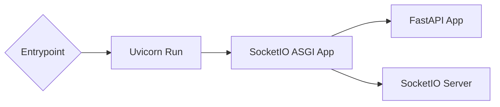
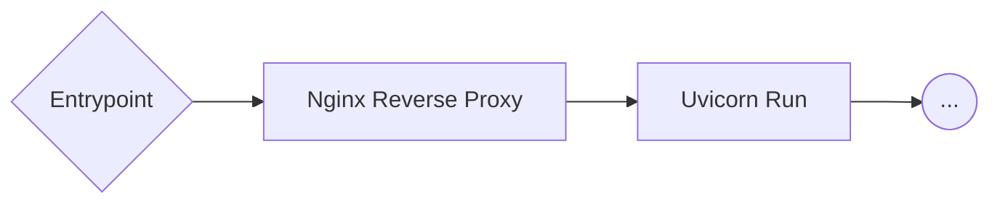

`KARSA MASCOPE - DEVELOPER DOCS - LAST MAJOR REVISION MARCH 2025`

# Mascope

This monorepo contains the Mascope backend and frontend as well auxiliary services, libraries and tooling.

This README - along with the [autogenerated docs](#autogenerated-docs) - serve as the primary developer documentation resource. It should be kept up-to-date.

This document is structured as follows:

- 🚀 **[Getting started](#getting-started)** - install and running
- 🚂 **[Runtime](#runtime)** - devops tooling
- 🤖 **[Agents](#agents)** - Python instrument agents
- 📡 **[Backend](#backend)** - Python API server
- 🖥️ **[Frontend](#frontend)** - VueJS user interface
- 📚 **[Libraries](#libraries)** - shared Python libraries
- 📒 **[Notebooks](#notebooks)** - Jupyter lab environment

The monorepo is structured as follows:

```sh
mascope/           # Monorepo root directory
  agents/            # Instrument machine agents
  libraries/         # Shared libraries
    chem/              # Chemical calculations
    file/              # Sample file loading, names & paths
    runtime/           # Config, logging, state and data
    sdk/               # Public client API library
    signal/            # Signal & peak processing
    thermo/            # ThermoFisher Orbitrap hardware API
    tofwerk/           # Tofwerk TOF hardware API
  server/            # Mascope app server
    backend/           # API server (Python, FastAPI, SQLite)
    frontend/          # Web client (Javascript, Vue, PrimeVue)
  tooling/           # Development tools
    cli/               # The `mascope` runtime CLI
    notebooks/         # Jupyter lab data science notebooks
  .runtime/          # Runtime data (.gitignored)
    env/               # Runtime data environments
    secrets/           # Secret keys & tokens
```

---

## Getting Started

The Mascope runtime includes setup scripts and a comprehensive `mascope` command line tool. This section explains how to setup this environment.

### Installation

Our setup scripts - found in the `tooling` folder - provide an `install` command to setup low-level prerequisites (_Python 3.12_, _Node 22_, _uv_ and _.NET Runtime_), package dependencies (via `uv`) and the `mascope` cli.

#### Windows

The only prerequisite is [Powershell 7](https://learn.microsoft.com/en-us/powershell/scripting/install/installing-powershell-on-windows), which should be available on Windows 11 by default.

To `install` your Mascope runtime, run:

```
git clone git@github.com:karsa-oy/mascope.git && cd mascope && .\tooling\windows.ps1 install
```

#### Ubuntu

The only prerequisite is [Bash](https://www.gnu.org/software/bash/), which is available on Ubuntu. The script has been developed against Ubuntu 22.04 LTS, but should work on later versions as well.

To `install` your Mascope runtime, run:

```
git clone git@github.com:karsa-oy/mascope.git && cd mascope && ./tooling/ubuntu.sh install
```

#### Updating

Since [`uv` automatically syncs the virtual environment](https://docs.astral.sh/uv/concepts/projects/sync/#automatic-lock-and-sync) and we run `npm install` every time we launch the dev server, there is usually no need to reinstall when switching branches.

If this doesn't work for some reason, the `tooling` scripts accept are `reinstall` and `uninstall` commands. These fully remove the `.venv`, `node_modules` and Mascope environment variables,but do not remove installed tooling (in case its used in other work).

### CLI

After following the [installation instructions](#installation) you have the Mascope CLI installed in the workspace's virtual environment. To access the CLI, first activate the virtual environment:

```sh
/Mascope> .venv/scripts/activate
```

Alternatively, to run commands in the virtual environment without explicitly activating it, start each command with `uv run <command>`.

With the virtual environment active, you can view the CLI's help by running

```sh
(mascope) /Mascope> mascope --help
```

The main subcommands are:

```sh
mascope dev       # install and run the dev environment
mascope prod      # build and run prod deployments
mascope env       # select and manage app runtimes
mascope logs      # query and clean up Mascope log files
mascope backend   # launch the backend & manage the db
mascope agent     # launch a mascope agent
mascope cert      # manage self-signed certificates
```

To launch the dev server run `mascope dev run`. You can view details of subcommands using `mascope runtime --help`.

See the [CLI development](#cli-development) section to learn how to extend the CLI.

### Dev Commands

```sh
mascope dev run                               # run the backend & frontend
mascope dev run --reload                      # HMR for the backend on Windows
mascope dev run --host                        # Expose dev server to the network
mascope dev run backend file-converter        # run specific modules in dev mode
mascope --log-grep foo dev run                # highlight log lines with foo
mascope -g foo dev run                        # highlight log lines with foo
mascope --log-level debug dev run             # set log level to debug
mascope -l debug dev run                      # set log level to debug
```

> [!IMPORTANT]
> On **Windows** you need to use `mascope dev run --reload` to enable hot module reloading on the backend. This launches the backend on a seperate Windows Terminal window.

### Prod Commands

Running in prod mode:

```sh
mascope prod up            # put up the prod containers
mascope prod up --build    # force build before putting up containers
mascope prod ps            # check production container status
mascope prod down          # put down the prod containers
mascope prod build         # build the production containers
```

### Env Commands

```sh
mascope env list            # list runtime env
mascope env use foo         # set foo as the active env
mascope env use default     # revert to the default env
```

### Dependency management

To add Python dependencies, use `uv add`. Be sure to add the depedency to the right package. If you need to add development envirionment dependencies, add them to the root project, with `uv add --dev`.

To add JavaScript dependencies, use `npm install` in the `server/frontend` folder.

Usually, `uv` will automatically sync dependencies. In rare cases such as modifying the `uv` workspace package interdepdencies, you may need to fully reinstall the project with the `tooling` script for your platform.

### Secrets

Running Mascope in `prod` mode requires the following "secrets" to be present in the `.runtime/secrets` directory:

- `jwt_secret_key.txt`: JSON Web Token API private key (arbitrary string)
- `mascope.app.key`: SSL certificate private key
- `mascope.app.pem`: SSL certificate
- `server_owner_secret_key.txt`: First owner registration private key (arbitrary string)

For testing the `prod` mode in local development environment, a self-signed SSL certificate can be generated using the script: `mascope cert gen`. The certificate as well as other secrets must be in place prior to building the containers.

---

## Runtime

Mascope's _runtime_ is a common framework underpining the app's devops toolchain. The runtime has a main interface:
the `mascope` [CLI](#cli). Mascope developers can use the CLI to select Mascope [environments](#runtime-envs):
these are folders containing the full state of a Mascope app (database, files, etc). Runtimes can be configured
with a set of [configuration files](#runtime-config) global app options for libraries, servers, services and agents.

The app can be run in two [modes](#runtime-modes): [dev](#runtime-dev) and [prod](#runtime-prod). Dev
mode runs the app's modules with Poetry and Vite. Prod mode builds two docker containers: the backend
and nginx reverse proxy serving the frontend bundle.

### Mascope path

In both dev and prod, Mascope's runtime and CLI rely on an env var called `MASCOPE_PATH` to discover the apps code and data. The `tooling` scripts are responsible for setting this environment variable on the system they install too.

For development environments, this path is the path to their clone of the Mascope repo. In production deployments, this can vary. You can find the Mascope path with the command `mascope path`.

### Runtime dir

The runtime's state is stored in a directory called `.runtime` in the [Mascope path](#mascope-path:

```
.runtime/          Config, logging, state and data
  env/                Runtime environments
  secrets/            Runtime secrets
  state.json          Runtime state (stores 'mode' and 'active' environment)
```

### Runtime Library

The runtime library exposes a Python API for initializing and using so-called _Mascope runtime modules_. The modules allow accessing runtime scope appropriate to the runtime module using it.

When you instantiate a Mascope runtime instance for some module, you can access that module's private configuration, the global runtime configuration and the logger.

```py
# server/backend/src/mascope_backend/runtime.py
runtime = Runtime('backend')

# elsewhere
from mascope_backend.runtime import runtime

# works
print(runtime.meta.api_port) # global config is under .meta
print(runtime.config.database) # backend specific config is under .config

# throws
print(runtime.file_converter.threads) # other modules are not exposed

runtime.logger.debug("who broke my code?")
runtime.logger.info("so normal, so boring....")
runtime.logger.error("oh no! what happened?")
```

### Runtime Modes

The runtime can be executed in two major modes: `dev` and `prod`. While `dev` mode spins up a Vite dev server and runs Unicorn with HMR, `prod` builds a docker container and runs Uvicorn behind Nginx.

#### Dev mode

The development environment works by running dev server commands listed in the [modules](#runtime-modules). These run `poetry` or `vite` dev servers and script to run other operations or services. By default, running
`mascope dev run` spins up the `backend` and `frontend` dev servers and joins their logs to one output. To enable HMR for the `backend` on Windows, run `mascope dev run --reload`. You can also specify other modules (run `mascope module --runnable` to see which). For an overview of the `dev` mode api, run `mascope dev --help`.

#### Prod mode

The production deployment for the mascope server - consisting of the `backend` and `frontend` (incl. proxy) modules - is deployed using `docker`. The docker files for these are in their respective folders. The whole thing is tied together with `docker compose`, allowing us to spin up the pair in tandem and automatically have them share a network (see `docker-compose.yaml` for config).

See `mascope prod --help` for extensive documentation, but in short:

```sh
mascope prod build  # build the containers
mascope prod up     # start the server (detatched)
mascope prod logs   # attach to the logs
mascope prod down   # stope the server
```

You can also run `mascope prod up --build` to build and run the containers.

### Runtime Modules

Since Mascope is a monorepo, and we require multimachine deployments, we need to think of Mascope as a set of modules.

To list the modules registered in our runtime library, run `mascope modules`. Modules can be optionally installable, as for those which correspond to poetry or npm packages. They can also optionally be runnable, like the file converter service or the frontend dev server.

Modules can also be run in _groups_: for example, `mascope dev run tof` will launch the `backend`, `frontend`, `tof` and `file-converter` modules. For a full list of groups, run `mascope groups`.

Modules' [configuration](#runtime-config] is scoped to that module and exposed to the module runtime.

### Runtimes Envs

The Mascope app requires multiple persistence mechanisms: SQLite, various files, configuration files and even a small state.json file. To facilitate ease of operations, these are organized in a single folder called a _runtime env_.

To list available envs, run `mascope env list`. To activate an env _foo_, run `mascope env use foo`. To revert to the _default_ env, run `mascope env use default`.

The `runtime/env` folder can contain multiple runtime environments. Only `default` - the team's standard development environment - is not `.gitignore`d. The folder structure looks like this:

```py
runtime/
  env/
    default/             # The built-in dev environment
    foo/                 # Some custom environment
      agents/              # Storage for instrument agents
      database/            # The primary SQLite db and its backups
      filestore/           # Stored raw and processed files
      filestreams/         # Network drive to receive incoming files
      logs/                # dev and prod logs
      temp/                # Temporary folder for ephemeral download files
      ...                  # .mascope.toml config files
```

Some folders may be symbolically linked to a runtime to facilitate network drives.

### Runtime Config

The `mascope.toml` files inside a runtime configures the app. The configuration includes app wide settings (under `meta`) and [module](#runtime-modules) specific configuration settings. There are two files, that have the same schema:

```py
runtime/
  env/
    foo/
      ...                  # Rest of the env's state
      dev.mascope.toml     # Development app config - overrides base in dev mode
      prod.mascope.toml    # Production app config - overrides base in prod mode
```

Here is an example of a small `dev.mascope.toml` you may use during development to override specific values:

```toml
[meta]
description = "My weird overrides"
log_level = "warning" # reduce overall log verbosity
api_port = 9876 # change the API port
filestore = "/home/mrfoo/secret/stash" # change the filestore path

[backend]
log_level = "debug" # debug the backend
database = "/home/mrfoo/secret/base" # change the database path
filestreams = "./foostreams"
```

Relative paths like `./database` are always resolved to the [runtime env]#runtime-env] path before the config is injected to the app.

> [!NOTE]
> For a complete list of options, refer to the defaults in `base.mascope.toml` at the monorepo root.

### Runtime Logging

Logging in the Mascope runtime leverages [Loguru](https://loguru.readthedocs.io/).

#### Log levels

The following log levels are available, in ascending order:

- **TRACE**
- **DEBUG**
- **INFO**
- **SUCCESS**
- **WARNING**
- **ERROR**
- **CRITICAL**

You can write messages using `runtime.logger`, which is a standard Loguru logger; all log levels are therefore methods of this object, i.e. you can do `runtime.logger.info("foo")` or `runtime.logger.critical("bar")`.

The log levels visible can be configured globally with the CLI (see the next section). You can also be set for each module individually by using the `log_level` option for that module, or globally by setting `log_level` for the `[meta]` configuration block. Module-specific settings will override this `[meta]` setting, while the `--log-level` command line option will override all configuration options. In all cases, they are not case-sensitive.

#### Terminal logs

When running `mascope dev run` or `mascope prod up`, the logger will emit formatted log lines to the terminal.

You can set the _terminal_ log level globally using the `--log-level` flag (`-l` for short):

```sh
mascope --log-level debug dev run
mascope -l critical prod up
```

If you want to highlight lines with certain key words, you can do use the `--grep` option (`-g` for short):

```sh
mascope -g foo dev run
```

By default, lines with log level `success` or above are highlighted.

#### Log files

In addition to terminal logs, a second handler writes log lines as newline-delimeted JSONS to log files.

The log files are named in the form `<date>.<module>.log` and placed in the active runtime environment's `logs/prod` and `logs/dev` folders, e.g. `runtime/env/default/logs/dev/2025-03-05.backend.log`. File logging excludes log levels below INFO, to prevent log file bloat.

> [!TIP]
> To query these logs with the CLI, you can run `mascope logs query`. To delete old or empty log files, use `mascope logs gc`.

#### Structured logging

The logs are _structured_, meaning each line is a JSON object including the various metadata provided. You can set the log file directory using the `log_path` configuration option, but it defaults to a folder called `logs` inside the runtime environment.

You can inject custom fields into the structure logs using [Loguru's bind method](https://loguru.readthedocs.io/en/stable/api/logger.html#loguru._logger.Logger.bind):

```py
modified_logger = runtime.logger.bind(some_metadata="foo")

modified_logger.info("I include the metadata")
```

Our logger has a special `key` metadata field which will appear in the terminal logs as well as the file logs. Its intentended to identify entities like objects and processes more granularly than the file level. In the terminal logs, this field is appended after the Python module.

For example the File converter streamer thread is used as a key:

```py
class FSWatcher(Thread):
    def __init__(
      # ...
    ):
        Thread.__init__(self)
        self.log = runtime.logger.bind(key=self.name)
```

Which logs the thread's identifier after the module path, e.g. `mascope_hardware.orbitrap.generator:83 Thread-1`.

### CLI Development

The CLI is written using [Typer](https://typer.tiangolo.com/), a type-hints based library for writing command line tools. These are called Typer _apps_ and can be nested to create grouped subcommands. In `mascope`, `modules` and `path` are simple commands (implemented directly in `runtime/cli/mascope_cli/main.py`), while `dev`, `prod` and `env` are subcommand apps found in the `cmd` folder.

The best resource for learning about the Typer API is the [Typer docs Learn section](https://typer.tiangolo.com/tutorial/).

---

## Agents

Agents are small Python programs installed with Pyinstaller on Windows instrument machines. They perform minimal transformations and move files to the server. As opposed to other packages, the agent dependencies are managed by separate Poetry environments, to avoid the need to compile whole uv workspace into the distributable.

```sh
agents/           # Instrument machine agents
  file/               # File Agent (for ThermoFisher Orbitrap instruments)
  tof_agent/          # TOF Agent (for Tofwerk TOF instruments)
  install_tooling.ps1 # Powershell script to install agent build tools (pipx, poetry)
```

### File Agent

The File Agent is responsible for uploading files from instrument machines unchanged to the server. This is designed for use in Orbitrap machines.

To run all services needed to emulate the Orbitrap acquisition workflow in development, run `mascope dev run orbi`.

### TOF Agent

The TOF Agent is responsible for transforming and transfering files from Tofwerk instrument machines to the server.

To run all services needed to emulate the Tofwerk acquisition workflow in development, run `mascope dev run tof`.

### Building Agents for production

To build for production, you execute a build script _on a Windows machine_. In this section we use the TOF Agent as an example, but the the File Agent functions analogously.

Before building, install the required tooling by running `install_tooling.ps1` located at the root of the `agents/` directory. The script will install Python, Pipx and Poetry if not already installed. Then, run the agent build script:

```
cd agents/tof
./build.ps1
```

Then run the executable found in `agents/tof/dist`.

When you run this executable, the `MASCOPE_PATH` will be `%AppData%\Mascope\TofAgent` and the runtime environment will therefore be `%AppData%\Mascope\TofAgent\runtime\env\prod`.

You will need to run the agent once so that it initializes the directory structure, but it will fail to resolve some paths because the configuration needs to be updated. Then go to the env path listed above and update `prod.mascope.toml` with:

1. Server URL
2. Access token with write access:
   - Log into Mascope web application (editor role or higher required)
   - Click the user profile icon to open the sidebar
   - In the "API Access Tokens" section, select "TOF Agent" from the dropdown
   - Generate and copy the access token (note: token is shown only once)

Then restart the agent, and the correct config is loaded and the agent is ready to go.

> [!IMPORTANT]
> In case the config schema is changed, any existing configuration in the target environment must be deleted prior to running the updated version of TofAgent, in order to initialize correct configs.

## Backend

```sh
server/
  backend/
    src/
      mascope_backend/
        api/                # Fast Routes, Socket Events & Pydantic Models
        app/                # Fast app, Socket server & app, Uvicorn launcher
        db/                 # SQLite init, schema, migrations and ops
        file_converter/     # File loading service
        socket/             # Event emitting and handling
        main.py             # The main entry point
        runtime.py          # The runtime instance of the backend
```

### Backend Tech

The main tech stack for the backend is as follows:

- [FastAPI](https://fastapi.tiangolo.com/) - HTTP/S REST API
- [Uvicorn](https://www.uvicorn.org/) - Main web server
- [SocketIO](https://python-socketio.readthedocs.io/en/latest/index.html) - WebSocket event API
- [Pydantic](https://docs.pydantic.dev/dev/) - Data model validation
- [SQLite](https://www.sqlite.org/docs.html) - In-process database
  - [SQLAlchemy](https://docs.sqlalchemy.org/en/20/index.html) - Object Relational Model

### Backend API

Mascope's server API is built mainly with FastAPI, supplemented by a limited number of SocketIO events
for enabling the frontend to react to changes in the backend. The `api` folder is organized as follows:

```
backend/
  mascope_backend/
    api/
      controllers/         business logic
      events/              socketio event handlers
      lib/                 shared code
      models/              pydantic data models
      routes/              fastapi routes
```

A `new` API structure is being organized in under `api.new`.

### Backend Auth

Mascope employs **Role-Based Access Control (RBAC)** and two authentication methods—**Cookie-based JWT authentication** for web users and **Access Token-based authentication** for external applications like Jupyter.

#### Cookie-based JWT authentication

Mascope's web application uses **JWT authentication** via cookies for secure session management. This approach provides seamless, session-like authentication for web users, but lucks the token admin cotrol.

- **Transport**: Cookies are configured with `HttpOnly` and `Secure` flags (in production), preventing client-side JavaScript access and providing secure transmission over HTTPS.
- **Token details**:
  - JWT tokens are signed using the API private secret key.
  - Cookies match the JWT expiration to simplify session management.

Routes authenticated via cookies are primarily designed for web-based user interactions with Mascope's primary UI.

The JWT secret key in production is stored at `${MASCOPE_PATH}/secrets/jwt_secret_key.txt` and deployed using Docker Compose secrets (see the compose file).

#### Access Token authentication

To enable authenticated access for external applications, such as Jupyter servers and the public `mascope_sdk` library, **Access Token-based authentication** is implemented.

- **Access Tokens**:
  - Stored in the database and linked to a user via the `AccessToken` model.
  - Tokens are issued with a defined lifetime, after which they expire and must be renewed.
  - Tokens can be generated and revoked via dedicated routes under `/api/auth/access_token`.
- **Endpoint compatibility**:
  - Endpoints that support access token authentication are explicitly marked with `token_access=True` in the `api_route` decorator.
  - The authentication system dynamically selects the appropriate backend (`auth_backend_access_token`) for such requests.
- **Use cases**:
  - Jupyter server integration, where tokens are passed via the `Authorization` header (`Bearer <access_token>`).
  - Public libraries like `mascope_sdk` that rely on external access.

#### Authorization

**Role-Based Access Control (RBAC)**

Roles are dynamically created during database migrations based on the configuration in `auth/config.py`. Each role is assigned a numeric `role_id`, indicating its privilege level.

The current roles include:

- **`guest`**: Read-only access (includes Jupyter-accessible endpoints via bearer access tokens).
- **`editor`**: Create, update, and delete permissions.
- **`admin`**: Full administrative rights, including user management.
- **`owner`**: Full permissions, including the ability to manage admins.

**Role-Based endpoint dependencies**

To secure routes, role-based dependencies are used. Examples:

```python

@fastapi_router.get("/api/resource")
async def resource_route(user: User = Depends(admin_user)):
    ...

```

Available dependencies: `guest_user`, `editor_user`, `admin_user`, and `owner_user`.

### API Response Format

Endpoints return responses in a unified structure to simplify client-side parsing. The structure includes:

- `message` (required): Describes the operation result.
- `results` (optional): Count of items (used for `get_all` endpoints).
- `data` (optional): Contains the payload, omitted for certain actions (e.g., `DELETE`).

**Example Success Response**:

```json
{
  "message": "Retrieved 3 instrument records",
  "results": 3,
  "data": [
    { "instrument": "KLTOF1", "type": "tof" },
    { "instrument": "KORBI2", "type": "orbi" },
    { "instrument": "MORBI", "type": "orbi" }
  ]
}
```

### Error handling

Errors are uniformly formatted to separate user-friendly messages from developer-level details:

**Example error response**:

```json
{
  "error": "User-friendly error message", // For client-side notifications
  "detail": {
    "error_message": "Detailed technical error message with context.",
    "traceback": "Stack trace for debugging (if available)."
  }
}
```

- `error`: Designed for client-side notifications. Display meaningful error messages directly to users.
- `detail`: Provides debug-level context, including technical `error_message` and a `traceback` stack trace. This is intended for developer debugging or logging tools.

### Autogenerated Docs

When running `mascope dev run`, autogenerated OpenAPI docs are available:

- **Swagger UI**: Accessible at `localhost:8090/docs`, this interactive UI allows developers to test API endpoints directly from their browser, view example requests/responses, and understand required parameters.
- **ReDoc**: Available at `localhost:8090/redoc`, this alternative interface provides a more structured, visually appealing API reference. It’s particularly useful for browsing the API’s capabilities in a hierarchical format.
- **OpenAPI specification**: The raw OpenAPI JSON schema is available at `/openapi.json`, enabling integration with external tools and services for API exploration or client code generation.

> [!TIP]
> For better devex, use [Postman](https://www.postman.com/) to access API docs. The staging server docs are [also hosted online](https://documenter.getpostman.com/view/27329225/2sA3kSn2t9).

### Backend App

To run the [API](#backend-api) we need to have multiple Python 'apps' and 'servers'.



In production, Uvicorn sits behind an [Nginx](https://nginx.org/en/docs/) reverse-proxy additionally:



### Backend DB

We use SQLite as our database, and the `db` folder includes a variety of scripts to help manage the database:

```
backend/
  mascope_backend/
    db/
      migration/        schema migration scripts
      ops/              database maintenance operations
      __init__.py       database initialization logic
```

### Backend File Converter

The file converter is an independent service typically running on the same machine as the backend.
It's responsible for transforming incoming data files and recording corresponding metadata to the
database. Its a distinct [module](#runtime-modules) which is launched independently using the
[CLI](#runtime-cli).

---

## Frontend

Our frontend is a Single Page Application written in [Vue](https://vuejs.org/guide/introduction.html) and plain Javascript. It has been heavily refactored and redesigned in Q1/Q2 2024.

The frontend folder structure is as follows:

```
public/       static files
scripts/      utility scripts
  build/        legacy build script
  palette.js    generates the Karsa palette
src/          source code
  api/          api client code
  lib/          shared library
  routes/        pages and navigation
  stores/        global app state
  ...         global vue app configs
tests/        playwright tests
  fixtures/     reusable test patterns
  ...
index.html    static template w/ font imports
package.json  npm package w/ dependencies
...           other tooling configs
```

### Frontend Tech

The Mascope frontend is build with the following technologies:

- [Vue 3](https://vuejs.org/guide/introduction.html) frontend framework, using:
  - [Composition API](https://vuejs.org/guide/extras/composition-api-faq.html#what-is-composition-api)
  - [Single File Components](https://vuejs.org/api/sfc-spec.html)
  - [`<script setup>`](https://vuejs.org/api/sfc-script-setup.html#script-setup)
- [Pinia stores](https://pinia.vuejs.org/introduction.html) with the [setup store syntax](https://pinia.vuejs.org/core-concepts/#Setup-Stores)
- [PrimeVue](https://primevue.org/introduction/) as the component library
- [Vite](https://vitejs.dev/guide/) as the build tool + dev server
- [Playwright](https://playwright.dev/docs/intro) for end-to-end tests

### Frontend Development

The frontend is deployed via a Vite dev server when running `mascope dev run`. This serves the frontend on `localhost:5173` and triggers hot module reloading (HMR) to reload the frontend whenver changes are made to frontend code. This is not always 100% reliable, especially when application state is involved which could be corrupted; to be safe, manually reload the page.

#### Acquisition Range Config

One important feature in the frontend is the _acquisition tab_. This allows users to select acquired files and load them into a batch.

In order to facilitate ergonomic development with the our standard test dataset, it can be helpful to configure the default time range selection in the [runtime config](#runtime-config) of the frontend:

```toml
# dev.mascope.toml

[frontend]
acquisition_filter = { min = '2022' }
```

You can also set a `max` if necessary, and you can provide any date string parsable by the [Javascript `Date` constructor](https://developer.mozilla.org/en-US/docs/Web/JavaScript/Reference/Global_Objects/Date/Date), e.g. `2023-05-23` or `2025-01-27T19:14`.

### Frontend Codebase

The source code directory:

```
  api/         api client code
  lib/         shared library
    base/          shared components
    charts/        plotly charts (with own stores)
    dialogs/       interactive modals
    panes/         larger panels and tabs
    toolbars/      various menu bars
    config.js      mascope's config toml
    constants.js   alarms list, collection and sample types
    mzFit.js       calibration composable
    table.js       spreadsheet utilities
    utils.js       miscillanious utilities
  routes/       pages and navigation
    index.js       the router
    MainRoute      prod app (/)
    TestRoute      dev sandbox (/test)
  stores/       global app state
    data/         data stores w/ mutating APIs
      lib/
        module.js     standard data module constructor
      index.js      useData hook (see for more notes)
      ...           data modules
    ui/           ui stores w/ read-only APIs
      index.js      useUi hook
      ...           ui modules
    index.js      useApp hook
  App.vue       app root component, includes toaster
  main.js       vue app and primevue initialization
  palette.json  Karsa colors, generated by script
  style.css     global styles overriding the theme
  theme.js      Karsa theme = palette.js + PrimeVue Aura theme
```

### Frontend API Client

The frontend uses HTTP and WebSocket clients.These are combined into a single client which you can import like this:

```js
// import the client
import { api } from "@/api";
```

#### Frontend HTTP Client

The frontend HTTP API uses [Axios](https://axios-http.com/docs/intro), exposing its API as transparently as possible. For example, this is how you create a workspace with the client:

```js
// create a new workspace:
api.http.post(
  // method
  `/workspaces`, // path
  { workspace_name: "Foo" }, // body
  {
    // config
    use: "create",
    type: "create_workspace",
  }
);
```

Here, `post` is a standard Axios method, receiving the route _url_ path as the first argument, the request _body_ in the second argument and _config_ options as the third argument. These options include two Mascope-specific custom fields: `use` and `type`; see the _Custom API_ section below for details. For all other options, see the Axios [request config docs](https://axios-http.com/docs/req_config).

To pass _path parameters_, use a template string for the url path. To pass _query parameters_, use the _params_ field of the config argument:

```js
// load peaks with areas and heights
const peaks = await api.http.get(`/sample/files/${sample_file_id}/peaks`, {
  params: {
    areas: true,
    heights: true,
  },
  use: "read",
  type: "load_sample_peaks",
});
```

The key methods used in our codebase at the moment are:

```js
api.http.get(url[, config])
api.http.delete(url[, config])
api.http.post(url[, data[, config]])
api.http.patch(url[, data[, config]])
api.http.postForm(url[, data[, config]])
```

But nothing stops you from using other Axios method; refer to the [Axios docs](https://axios-http.com/docs/api_intro) for details. Note here that their signatures differ, and that all arguments but the _url_ field are optional.

The most common endpoints are wrapped a second time in the [store actions](#frontend-stores), providing a friendlier API for most usecases in the frontend. Typically, you would use these wrappers when they are available. If a new endpoint is added, it may make sense to add such a wrapper to the appropriate store.

**Custom API**

The only Mascope-specific API elements added are the `use` and `type` fields added to the _config_ object. The `type` argument should be a snake case title-like identifier for the call, and is rendered as the header of the notification toasts shown to users.

The `use` argument allows specifying a so-called _handler_; this is a Mascope custom abstraction describing what to do with the response of the requestion: which status codes are considered successful, what to unpack from the response and return and what notifications - if any - to show the user. The handlers available currently are: _create_, _read_, _update_, _delete_ and _process_. The latter is for long-running background processes emitting progress notifications, like rematching or recalibration.

Handlers should be modified infrequently, as we hope to limit their number to handful of useful patterns. They are defined in `frontend/src/api/handlers.js`; as an example, this is how the `create` handler is implemented:

```js
import { useApp } from "@/stores";

export default {
  // ...
  create: (response) => {
    const { type, status, message, data } = unpack(response);
    const app = useApp();
    if (status == 201) {
      // notify users
      app.ui.notification.push({
        type,
        message,
        status: "success",
      });
      return data;
    } else {
      // warn developers is the response
      // was not handled
      unhandled(response);
      return;
    }
  },
  // ...
};
```

In rare cases, it makes sense to forego the handler in favor of creating custom handling logic for a specific usecase. For example, file upload is sufficiently idiosyncratic that is warrants a custom handler (see `frontend/src/stores/data/sample.js`).

#### Frontend Socket Client

The frontend socket API uses [SocketIO](https://socket.io/docs/v4/client-socket-instance/), exposing its API as transparently as possible. Basic event handling is done as follows:

```js
// log workspaces on reload event:
api.socket.on("workspace_reload", async () => {
  const workspaces = api.http.get(`/workspaces`, {
    use: "read",
    type: "load_workspaces",
  });
  console.log(workspaces);
});
```

### Frontend Stores

The frontend uses [Pinia stores](https://pinia.vuejs.org/introduction.html) with the [setup store syntax](https://pinia.vuejs.org/core-concepts/#Setup-Stores), the recommended store library for Vue 3.

Our stores are organized into two groups:

- **Data stores** which reflect our backend data model reactively, and which _read/write access to the backend_ through API wrappers.
- **UI stores** which model frontend concepts reactively, and which _optionally_ leverage _read-only access to the backend_ if needed.

While the UI stores are implemented in a variety of ways, Data stores frequently leverage a _standard data module_ abstraction developed by our team to streamline aspects of data loading and selection. As a convenience, we offer a unified store API hook, which is namespaced by this grouping:

```js
import { useApp } from "@/stores";
const app = useApp();

// get all workspace
app.data.workspace.list;
// create a batch
app.data.batch.create({
  //...
});
// dark theme enabled
app.ui.darkmode.active;
// left split size
app.ui.split.left;
```

#### Standard data modules

The so-called _standard data module_ abstraction can be found in `src/stores/data/lib/module.js`. It is used to implement several key data modules, including `workspace`, `batch`, `sample`, `target` and `mechanism`.

The core idea of these modules is to define a _hierarchical data loading and selection model_. Modules are linked via parent-child relations, and selecting a parent will load the appropriate child data. For example, the `workspace` module is the parent of the `batch` store; if you select a different workspace, the batch data of that workspace needs to be loaded, while the old data needs to be unloaded.

**_Using data modules_**

As an example of the most common API options, lets use the `batch` module as an example for the rest of this section; the other modules share the same API, so you can use the same methods.

A key concept in our data modules is `focus`. This is an API is designed for _single selection_: there is always at most 1 row focused. The API offers a two-way `v-model` binding to enable you to easily sync component and store state:

```html
<select
  v-model="app.data.batch.focused"
  :options="app.data.batch.list"
  dataKey="sample_batch_id"
  optionLabel="sample_batch_name"
/>

<span>{{app.data.batch.focused.sample_batch_name}}</span>
<span v-if="app.data.batch.focused">
  <!-- we also offer a `focusedId` helper: -->
  {{app.data.batch.focused.sample_batch_id == app.data.batch.focusedId }}
  <!-- i.e. this is always true if something is focused -->
</span>
```

You can also impertively apply, remove and check focus by calling the `focus`, `unfocus` and `active` methods:

```js
app.data.batch.focus(someBatch); // often you would focus using a batch record
app.data.batch.isFocused(someBatch); // true
app.data.batch.focus({ sample_batch_id }); // but only the id is actually needed
app.data.batch.unfocus(); // unfocusing requires no arguments
```

The implentation has a currently unutilized feature to enable multiselection. This was implemented for future use. Since it shouldn't really be used at the moment, it will not be documented yet.

**_Data module operatons_**

In addition to selection, the data modules expose API methods as a convenience. These are _not_ standardized, although most modules include common operations like `create`, `update` and `delete`.

> [!CAUTION]
> While calling API operations like create or delete will automatically update the frontend state, the operations do _not_ await this synchronization. In other words, awaiting `app.data.batch.create` doesn't guarantee the presence of a new record in `app.data.batch.list`. You must use Vue watchers to "await" the updated data and perform actions with it.

**_Implementing data modules_**

For creating new data modules, you import the `defineModule` constructor and create a new store hook, similar to how Pinia stores are normally made. A variety of options are available to configure the module:

```js
import { defineModule } from "./lib/module";
import { useWorkspace } from "./workspace";
import { api } from "@/api";
import { useMzFit } from "@/lib/mzFit";

export const useBatch = defineModule({
  // Name maps to `app.data.batch` store      [required]
  name: "batch",
  // Unique row id enables data replacement   [required]
  key: "sample_batch_id",
  // Define the parent by passing its hook
  useParent: useWorkspace,
  // Subscribe to socket io rooms by key
  // in this case, selecting a row will
  // create a sub for its sample_batch_id
  subscribe: true,
  // Define events that trigger reload
  // other then parent selection change
  reloadOn: "sample_batch_reload",
  // Load function fetching the data
  // from the backend. If the module
  // has a parent, the arg is its key;
  // otherwise no arg is provided. The
  // function should return the data.         [required]
  load: ({ workspace_id }) =>
    api.http.get(`/sample/batches`, {
      params: { workspace_id },
      use: "read",
      type: "load_batches",
    }),
  // We can also (optionally) define
  // standard CRUD operations
  read: (sample_batch_id) =>
    api.http.get(`/sample/batches/${sample_batch_id}`, {
      use: "read",
      type: "read_batch",
    }),
  create: (batch) =>
    api.http.post(`/sample/batches/`, batch, {
      use: "create",
      type: "create_batch",
    }),
  update: (batch) =>
    api.http.patch(`/sample/batches/${batch.sample_batch_id}`, batch, {
      use: "update",
      type: "update_batch",
    }),
  delete: ({ sample_batch_id }) =>
    api.http.delete(`/sample/batches/${sample_batch_id}`, {
      use: "process",
      type: "delete_batch",
    }),
  // And we can even define arbitrary custom
  // operations, which are passed through to
  // the store unchanged, e.g:
  importSamples: async ({ batch, sample_items }) => {
    const mzFit = useMzFit();
    return await api.http.post(
      `/sample/batches/${batch.sample_batch_id}/import`,
      {
        sample_items,
        mz_calibration_params: mzFit.mzCalibrationParams,
      },
      {
        use: "process",
        type: "import_samples",
      }
    );
  },
  // etc.
});
```

Two additional options are available but not listed:

- `unfocusBefore` allows you define an array of operations before which the module should be unfocused; for example, the `sample` module is unfocused before the `delete` operation to prevent certain bugs.
- `multiselect` allows enabling multiselection in the module, e.g. as with `sample` module

When implementing new modules, we need to remember to the add the hook into the `useData` hook in `stores/data/index.js`. This will then include it under the
`app.data` namespace in the `useApp` hook.

**_Semistandard: the Match modules_**

The match collection, compound, ion and isotope modules are implemented in a _semistandard_ way. They leverage the `defineModule` abstraction, but do so in a slightly hacky way. This was deemed the lesser of all evils. For more information, read the comments in the file: `frontend/stores/data/match.js`.

### Frontend User Help

The frontend includes a user 'help mode' feature, which can be toggled by users using a button in the top toolbar or by the keyboard shortcut `alt+h`. In help mode, detailed info cards are shown when a user hovers over a specific element or component on the page. The help feature state is managed in the `app.ui.help` store.

Help cards are implemented using the [Floating UI](https://floating-ui.com/docs/getting-started) library, as well as custom code found in `frontend/src/lib/help` and the help store.

You can add help cards in two ways: a [_Vue custom directive_](https://vuejs.org/guide/reusability/custom-directives.html#custom-directives) added to HTML elements, or a [_PrimeVue pass-through object_](https://primevue.org/passthrough/) passed to the `pt` prop in PrimeVue components. Help cards can be _positioned_ at the `top`, `bottom`, `left` or `right` of the target element. Optionally, an _alignment_ of `start` or `end` can be appended, e.g. `left_start` or `bottom_end`. This is useful when your card would otherwise overlow the edge of the viewport.

Since overlays such as sidebars and modals can cause confusing interactions, the help card API includes a concept of _layers_. As a developer, you need to toggle layer activation when opening or closing dialogs and sidebars:

```js
const layer = "my_sidebar";
watchEffect(() => {
  app.ui.help.set(sidebarActive.value ? layer : null);
});
```

The layer needs to be passed to all help cards in the overlay. This will be elaborated below.

#### User Help Directive

The help directive is added globally in `main.js`; this means that for the _base_ layer (as opposed to _overlays_) you can simply do:

```vue
<menu
  v-help.right="
    `
  <h1>Foo Bar Menu</h1>

  <p>This HTML will be rendered
  in the help card.</p>

  <p>In <i>help mode</i>, the card
  will be rendered when the user's
  mouse is inside this element.</p>
`
  "
>
  <!-- etc. -->
</menu>
```

To use directives in an overlay layer, you can instantiate a custom directive for your layer:

```vue
<script setup>
import { useApp } from "@/stores";

const app = useApp();

const layer = "my_dialog";
const vHelpLayer = app.ui.help.directive(layer);
</script>

<template>
  <div
    v-help-layer.bottom_end="
      `
    <h1>This help card is in the
    <i>my_dialog</i> layer</h1>
  `
    "
  >
    <!-- etc. -->
  </div>
</template>
```

#### User Help Pass-Through Object

PrimeVue components include a special [pass-through feature](https://primevue.org/passthrough/) that allows passing various props into elements _inside_ the components. Our help API leverages this to allow us to inject help cards into PrimeVue components via the `pt` prop:

```vue
<Button
  label="Push It!"
  @click="doSomething"
  :pt="
    app.ui.help.right_end(`
        <h1>Push it, push it some mooooore...</h1>
      `)
  "
/>
```

The API is similar to the directives, but leverages an action inside the help store. To specify the layer, pass an `options` object with a `layer` field as a second argument:

```vue
<script setup>
import { useApp } from "@/stores";

const app = useApp();

const layer = "my_dialog";
</script>

<template>
  <Button
    label="The Cake is a Lie!"
    @click="bakeIt"
    :pt="
      app.ui.help.top(
        `
        <h1>This is in the <i>my_dialog</i> layer</h1>
      `,
        { layer }
      )
    "
  />
</template>
```

### Frontend Tests

> [!CAUTION]
> These tests are super flakey and not really in use at the moment.

Our frontend currently only has a handful of tests written in [Playwright](https://playwright.dev/docs/intro).
These are end-to-end tests which work by running headless browsers and emulating real user behavior like clicks.
The test then checks that certain elements are or are not visible in the page.

#### Running the tests

To run the tests, you can run one of the following commands:

```
COMMAND               ARG           USECASE                DESCRIPTION
npm run test          optional      test feature branch    run all tests on chrome only
npm run test:full     optional      test prod release      run all tests on chrome, safari & firefox
npm run test:only     required      debug failed tests     run one test
npm run test:trace    required      debug failed tests     run test with a trace
npm run test:headed   recommended   debug failed tests     run test(s) headed
npm run test:gen      none          write new tests        run the visual test generator
```

Here, the argument is a string with the name of the test or a keyword (playwright will
execute all tests matching the string). You can also run the tests directly with playwright,
refer to the Playwright docs for more details.

#### Flakey tests

Use the debugging methods listed above when facing flakey tests. Often tests will be less flakey when
you run them in headed mode, and when you don't run them concurrently (this is why we configured Playwright
to use only one worker).

---

## Libraries

A set of shared libraries facilitate code sharing across the monorepo (excluding the frontend, which is in
Javascript). In addition to the three libraries listed here, the [Runtime Library](#runtime-library)

```sh
  libraries/         # Shared libraries
    chem/              # Chemical calculations
    file/              # Sample file loading, names & paths
    runtime/           # Config, logging, state and data
    sdk/               # Public client API library
    signal/            # Signal & peak processing
    thermo/            # ThermoFisher Orbitrap hardware API
    tofwerk/           # Tofwerk TOF hardware API
```

The libraries dependency structure is as follows:

```mermaid
flowchart LR
    backend([mascope_backend])
    chem([mascope_chem])
    signal([mascope_signal])
    file([mascope_file])
    tofwerk([mascope_tofwerk])
    thermo([mascope_thermo])
    runtime([mascope_runtime])
    file_agent([mascope_file_agent])
    tof_agent([mascope_tof_agent])
    cli([mascope_cli])

    classDef library fill:#ba642e,stroke-width: 0;
    class chem,signal,file,tofwerk,thermo library;

    classDef service fill:#02607a,stroke-width: 0;
    class backend service;

    classDef agent fill:#8e3688,stroke-width: 0;
    class tof_agent,file_agent agent;

    classDef cli fill:#2e845c,stroke-width: 0;
    class cli cli;

    classDef runtime fill:#3f3f3f,stroke-width: 0;
    class runtime runtime;

    %% services
    backend --> file
    backend --> signal
    backend --> tofwerk
    backend --> thermo
    backend --> chem

    %% libraries
    thermo --> file
    tofwerk --> file
    signal --> file
    signal --> tofwerk
    signal --> thermo

    %% agents
    tof_agent --> tofwerk

    %% runtime
    backend -.-> runtime
    thermo -.-> runtime
    tofwerk -.-> runtime
    chem -.-> runtime
    file -.-> runtime
    signal -.-> runtime
    tof_agent -.-> runtime
    file_agent -.-> runtime
    cli -.-> runtime

```



### Mascope SDK

This library exposes a public Python SDK for end-users to leverage especially in Jupyter notebooks.

#### Test publish

To make a test publish in [Test Python Package Index (TestPyPI)](https://test.pypi.org/), you need to register an account, generate an API token and then configure the `test-pypi` repository in `poetry`:

```sh
poetry config repositories.test-pypi https://test.pypi.org/legacy/
poetry config pypi-token.test-pypi <YOUR-API-TOKEN>
```

Once configured, to make a test publish, run the following commands:

```sh
poetry version patch            # Bump version number (<major>.<minor>.<patch>)
poetry build                    # Build distributable
poetry publish -r test-pypi     # Publish in PyPI
```

To verify that the publish worked as expected, run the Powershell script `/libraries/mascope_sdk/tests/test_install.ps1`. It will create a virtual environment, install the `mascope_sdk` package from TestPyPI and run `/libraries/mascope_sdk/tests/test_import.py`. You should see the package version number printed in the terminal.

#### Publish

To publish the package in the _real_ [Python Package Index (PyPI)](https://pypi.org/), you need to register an account and generate an API token. Then, when running commands, you pass the token with `--token`.
To publish the package, run the following commands:

```sh
uv build                              # Build distributable
uv publish --token <MY TOKEN>         # Publish in PyPI
```

You should manually set the package version in `pyproject.toml` to the last commit date in ISO format (use `git log -1 --date=format:"%Y.%m.%d" --format="%ad"` on the branch you are releasing from to find it). After releasing you should set it back to `0.0.0`.

---

## Notebooks

The notebooks - found in `tooling/notebooks` - provide a set of Jupyter notebooks along with a `uv` environment that includes
Jupyter lab. To use it, run `mascope dev run ==lab` and navigate to `localhost:8888`.
