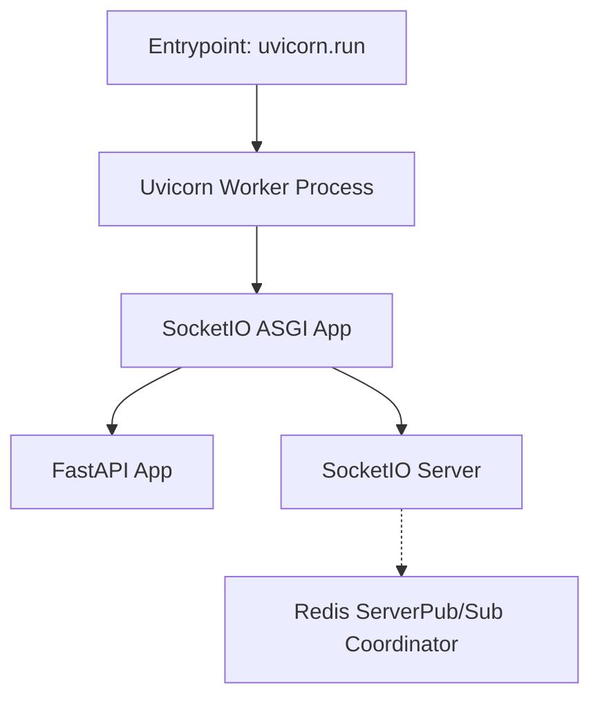
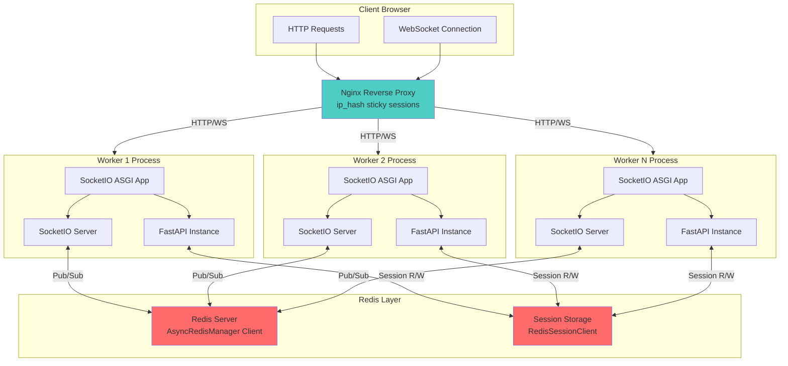

`KARSA MASCOPE - DEVELOPER DOCS - LAST MAJOR REVISION MARCH 2025`

# Mascope

This monorepo contains the Mascope backend and frontend as well auxiliary services, libraries and tooling.

This README - along with the [autogenerated docs](#autogenerated-docs) - serve as the primary developer documentation resource. It should be kept up-to-date.

This document is structured as follows:

- 🚀 **[Getting started](#🚀-getting-started)** - install and running
- 🚂 **[Runtime](#🚂-runtime)** - devops tooling
- 🤖 **[Agents](#🤖-agents)** - Python instrument agents
- 📡 **[Backend](#📡-backend)** - Python API server
- 🖥️ **[Frontend](#🖥️-frontend)** - VueJS user interface
- 📚 **[Libraries](#📚-libraries)** - shared Python libraries
- 🚚 **[Deploying](#🚚-deploying)** - prod operations guide
- 📒 **[Notebooks](#📒-notebooks)** - Jupyter lab environment
- 📝 **[Git conventions](#📝-git-conventions)** - Git conventions for developers

The monorepo is structured as follows:

```sh
mascope/           # Monorepo root directory
  agents/            # Instrument machine agents
  libraries/         # Shared libraries
    chem/              # LEGACY: Chemical calculations
    file/              # Sample file loading, names & paths
    match/             # Matching (targeted analysis) module
    molmass/           # Chemical formula parsing
    runtime/           # Config, logging, state and data
    sdk/               # Public client API library
    signal/            # Signal & peak processing
    thermo/            # ThermoFisher Orbitrap hardware API
    tofwerk/           # Tofwerk TOF hardware API
    tools/             # Standalone package with peak alignment etc.
  server/            # Mascope app server
    backend/           # API server (Python, FastAPI, SQLite)
    frontend/          # Web client (Javascript, Vue, PrimeVue)
  tooling/           # Development tools
    cli/               # The `mascope` runtime CLI
    notebooks/         # Jupyter lab data science notebooks
  .runtime/          # Runtime data (.gitignored)
    env/               # Runtime data environments
    secrets/           # Secret keys & tokens
```

---

## 🚀 Getting Started

The Mascope runtime includes setup scripts and a comprehensive `mascope` command line tool. This section explains how to setup this environment.

### Installation

Our setup scripts - found in the `tooling` folder - provide an `install` command to setup low-level prerequisites (_Python 3.12_, _Node 22_, _uv_, _Docker_ and _.NET Runtime_), package dependencies (via `uv`) and the `mascope` cli.

#### Windows

The only prerequisite is [Powershell 7](https://learn.microsoft.com/en-us/powershell/scripting/install/installing-powershell-on-windows), which should be available on Windows 11 by default.

To `install` your Mascope runtime, run:

```
git clone git@github.com:karsa-oy/mascope.git && cd mascope && .\tooling\windows.ps1 install
```

#### Ubuntu

The only prerequisite is [Bash](https://www.gnu.org/software/bash/), which is available on Ubuntu. The script has been developed against Ubuntu 22.04 LTS, but should work on later versions as well.

To `install` your Mascope runtime, run:

```
git clone git@github.com:karsa-oy/mascope.git && cd mascope && ./tooling/ubuntu.sh install
```

#### Updating

Since [`uv` automatically syncs the virtual environment](https://docs.astral.sh/uv/concepts/projects/sync/#automatic-lock-and-sync) and we run `npm install` every time we launch the dev server, there is usually no need to reinstall when switching branches.

If this doesn't work for some reason, the `tooling` scripts accept are `reinstall` and `uninstall` commands. These fully remove the `.venv`, `node_modules` and Mascope environment variables,but do not remove installed tooling (in case its used in other work).

### CLI

After following the [installation instructions](#installation) you have the Mascope CLI installed in the workspace's virtual environment. To access the CLI, first activate the virtual environment:

```sh
/Mascope> .venv/scripts/activate
```

Alternatively, to run commands in the virtual environment without explicitly activating it, start each command with `uv run <command>`.

With the virtual environment active, you can view the CLI's help by running

```sh
(mascope) /Mascope> mascope --help
```

The main subcommands are:

```sh
mascope dev       # install and run the dev environment
mascope prod      # build and run prod deployments
mascope env       # select and manage app runtimes
mascope logs      # query and clean up Mascope log files
mascope backend   # launch the backend & manage the db
mascope agent     # launch a mascope agent
mascope cert      # manage self-signed certificates
```

To launch the dev server run `mascope dev run`. You can view details of subcommands using `mascope runtime --help`.

See the [CLI development](#cli-development) section to learn how to extend the CLI.

### Dev Commands

```sh
mascope dev run                               # run the backend & frontend
mascope dev run --reload                      # HMR for the backend on Windows
mascope dev run --host                        # Expose dev server to the network
mascope dev run backend file-converter        # run specific modules in dev mode
mascope --log-grep foo dev run                # highlight log lines with foo
mascope -g foo dev run                        # highlight log lines with foo
mascope --log-level debug dev run             # set log level to debug
mascope -l debug dev run                      # set log level to debug
```

### Redis Commands

```sh
mascope dev redis start       # Start Redis container (auto-starts with backend)
mascope dev redis stop        # Stop Redis container
mascope dev redis restart     # Restart Redis container
mascope dev redis status      # Show Redis configuration and status
mascope dev redis logs        # View Redis logs (--follow, --tail options)
mascope dev redis cli         # Open Redis CLI for debugging

# Or access Redis CLI directly
docker exec -it mascope_redis_dev redis-cli    # Dev mode
docker exec -it mascope-redis-1 redis-cli      # Prod mode
```

**Useful Redis CLI commands:**

```sh
INFO                         # Server info and stats
CLIENT LIST                  # Show connected clients
KEYS mascope:session:*       # List all user sessions
GET mascope:session:/:{sid}  # View session data
TTL mascope:session:/:{sid}  # Check session TTL
MONITOR                      # Watch all Redis commands (Ctrl+C to exit)
PUBSUB CHANNELS              # List Socket.IO pub/sub channels
```

See [Redis CLI documentation](https://redis.io/docs/latest/develop/tools/cli/) for more commands.

> [!IMPORTANT]
> On **Windows** you need to use `mascope dev run --reload` to enable hot module reloading on the backend. This launches the backend on a separate Windows Terminal window.

### Prod Commands

Running in prod mode:

```sh
mascope prod up            # put up the prod containers
mascope prod up --build    # force build before putting up containers
mascope prod ps            # check production container status
mascope prod down          # put down the prod containers
mascope prod build         # build the production containers
```

### Env Commands

```sh
mascope env list                  # list runtime env
mascope env use foo               # set foo as the active env
mascope env use default           # revert to the default env
mascope env sync <source> <dest>  # synchronize source env into dest env
```

### Env sync

The `env sync` command synchronizes runtime environments locally or to/from a remote host. It transfers both the filestore (via [rsync](https://linux.die.net/man/1/rsync)) and the PostgreSQL database (via `pg_dump`/`pg_restore` staged through a transfer directory). Both source and target require an explicit mode (`dev` or `prod`) to identify which PostgreSQL server to use.

> [!IMPORTANT]
> Both PostgreSQL containers must be running on source and target machines before executing `env sync`.

Usage examples:

```bash
# local → local
mascope env sync default dev foo dev

# local → remote
mascope env sync foo prod user@192.168.1.100:bar prod

# remote → local, database only
mascope env sync user@192.168.1.100:bar prod baz prod --skip-filestore

# local → local, filestore only
mascope env sync foo dev bar dev --skip-db
```

The `sync` command follows symbolic links on Linux filesystem both ways - syncing into and from a symlinked directory.

If the target environment does not exist, you will be prompted to create it. Pass `--yes` to skip the prompt.

On transfer failure the staged dump is preserved in `.runtime/database/transfer/` for manual recovery. On success it is deleted and 7-day retention pruning runs automatically.

### Windows (Cygwin)

To use `env sync` on Windows, [Cygwin](https://www.cygwin.com/) must be installed into the default location `C:\cygwin64`. During installation, select the `rsync` and `openssh` packages.

### SSH key setup

`mascope env sync` issues multiple SSH/scp operations per sync (existence check, env create, dump, transfer, restore, cleanup, rsync). To avoid being prompted for a password or passphrase on each one, configure a dedicated no-passphrase key.

> [!NOTE]
> This key is only used by `mascope env sync`. If you also want password-free direct `ssh` access from PowerShell or Windows Terminal, that requires a separate key added to the Windows OpenSSH agent.

**Linux** - run in a terminal on the machine you are syncing from:

```bash
ssh-keygen -t ed25519 -C "mascope-sync" -f ~/.ssh/mascope_sync -N ""
ssh-copy-id -i ~/.ssh/mascope_sync.pub USER@HOST  # prompted for remote password once
```

**Windows** - the key must live in **Cygwin's home directory** (`/home/<user>/.ssh/`). A key generated in PowerShell will not be found by the CLI. Open a Cygwin terminal (Start menu → search _Cygwin Terminal_) and run:

```bash
ssh-keygen -t ed25519 -C "mascope-sync" -f ~/.ssh/mascope_sync -N ""
ssh-copy-id -i ~/.ssh/mascope_sync.pub USER@HOST  # prompted for remote password once
```

Verify the key works before running sync:

```bash
ssh -i ~/.ssh/mascope_sync -o BatchMode=yes USER@HOST echo ok
# should print: ok
```

Once the key is in place, `mascope env sync` picks it up automatically - no password or passphrase prompts during sync on either platform.

### Dependency management

To add Python dependencies, use `uv add`. Be sure to add the dependency to the right package. If you need to add development environment dependencies, add them to the root project, with `uv add --dev`.

To add JavaScript dependencies, use `npm install` in the `server/frontend` folder.

Usually, `uv` will automatically sync dependencies. In rare cases such as modifying the `uv` workspace package interdependencies, you may need to fully reinstall the project with the `tooling` script for your platform.

### Secrets

Running Mascope in `prod` mode requires the following "secrets" to be present in the `.runtime/secrets` directory:

- `jwt_secret_key.txt`: JSON Web Token API private key (arbitrary string)
- `mascope.app.key`: SSL certificate private key
- `mascope.app.pem`: SSL certificate
- `server_owner_secret_key.txt`: First owner registration private key (arbitrary string)

For testing the `prod` mode in local development environment, a self-signed SSL certificate can be generated using the script: `mascope cert gen`. The certificate as well as other secrets must be in place prior to building the containers.

**Known issues:** On Windows, for the local environment, you may need to point to a proper `cnf` file first with `$env:OPENSSL_CONF="C:\Program Files\Git\usr\ssl\openssl.cnf"` command. Another problem - `mascope cert gen` may create folders instead of files in the `.runtime/secrets` directory. In this case, you can manually create the files and rerun the command.

---

## 🚂 Runtime

Mascope's _runtime_ is a common framework underpinning the app's devops toolchain. The runtime has a main interface:
the `mascope` [CLI](#cli). Mascope developers can use the CLI to select Mascope [environments](#runtime-envs):
these are folders containing the full state of a Mascope app (database, files, etc). Runtimes can be configured
with a set of [configuration files](#runtime-config) global app options for libraries, servers, services and agents.

The app can be run in two [modes](#runtime-modes): [dev](#runtime-dev) and [prod](#runtime-prod). Dev
mode runs the app's modules with uv and Vite. Prod mode builds four docker containers: the backend, nginx reverse proxy serving the frontend bundle, the file converter, and redis.

### Mascope path

In both dev and prod, Mascope's runtime and CLI rely on an env var called `MASCOPE_PATH` to discover the apps code and data. The `tooling` scripts are responsible for setting this environment variable on the system they install too.

For development environments, this path is the path to their clone of the Mascope repo. In production deployments, this can vary. You can find the Mascope path with the command `mascope path`.

### Runtime dir

The runtime's state is stored in a directory called `.runtime` in the [Mascope path](#mascope-path:

```
.runtime/          Config, logging, state and data
  env/                Runtime environments
  secrets/            Runtime secrets
  state.json          Runtime state (stores 'mode' and 'active' environment)
```

### Runtime Library

The runtime library exposes a Python API for initializing and using so-called _Mascope runtime modules_. The modules allow accessing runtime scope appropriate to the runtime module using it.

When you instantiate a Mascope runtime instance for some module, you can access that module's private configuration, the global runtime configuration and the logger.

```py
# server/backend/src/mascope_backend/runtime.py
runtime = Runtime('backend')

# elsewhere
from mascope_backend.runtime import runtime

# works
print(runtime.meta.api_port) # global config is under .meta
print(runtime.config.database) # backend specific config is under .config

# throws
print(runtime.file_converter.threads) # other modules are not exposed

runtime.logger.debug("who broke my code?")
runtime.logger.info("so normal, so boring....")
runtime.logger.error("oh no! what happened?")
```

### Runtime Modes

The runtime can be executed in two major modes: `dev` and `prod`. While `dev` mode spins up a Vite dev server and runs Unicorn with HMR, `prod` builds a docker container and runs Uvicorn behind Nginx.

#### Dev mode

The development environment works by running dev server commands for each [module](#runtime-modules).
These commands use `uv` to run Python services and `vite` to run the frontend dev server, along with scripts for other operations or services.

**Prerequisites:**

- Docker daemon running (required for Redis)
- Redis container will auto-start when running `mascope dev run backend`

By default, running `mascope dev run` spins up the `backend` (with Redis) and `frontend` dev servers and joins their logs to one output. To enable HMR for the `backend` on Windows, run
`mascope dev run --reload`. You can also specify other modules (run `mascope module --runnable` to see which). For an overview of the `dev` mode api, run `mascope dev --help`.

#### Prod mode

The production deployment for the mascope server consists of containerized services orchestrated via `docker compose`:

- **redis**: Redis server for Socket.IO coordination and session storage
- **backend**: Multi-worker Python API server (Uvicorn + FastAPI + Socket.IO)
- **frontend**: Nginx reverse proxy serving Vue.js bundle with sticky sessions
- **file_converter**: Service responsible for transforming incoming data files and recording corresponding metadata to the
  database.

The containers share a Docker network and use health checks for proper startup order (redis → backend → frontend). See `docker-compose.yaml` for full configuration.

See `mascope prod --help` for extensive documentation, but in short:

```sh
mascope prod build  # build the containers
mascope prod up     # start the server (detached)
mascope prod logs   # attach to the logs
mascope prod down   # stope the server
```

You can also run `mascope prod up --build` to build and run the containers.

### Runtime Modules

Since Mascope is a monorepo, and we require multimachine deployments, we need to think of Mascope as a set of modules.

To list the modules registered in our runtime library, run `mascope modules`. Modules can be optionally installable, as for those which correspond to poetry or npm packages. They can also optionally be runnable, like the file converter service or the frontend dev server.

Modules can also be run in _groups_: for example, `mascope dev run tof` will launch the `backend`, `frontend`, `tof` and `file-converter` modules. For a full list of groups, run `mascope groups`.

Modules' [configuration](#runtime-config] is scoped to that module and exposed to the module runtime.

### Runtimes Envs

The Mascope app requires multiple persistence mechanisms: SQLite, various files, configuration files and even a small state.json file. To facilitate ease of operations, these are organized in a single folder called a _runtime env_.

To list available envs, run `mascope env list`. To activate an env _foo_, run `mascope env use foo`. To revert to the _default_ env, run `mascope env use default`.

The `runtime/env` folder can contain multiple runtime environments. Only `default` - the team's standard development environment - is not `.gitignore`d. The folder structure looks like this:

```py
runtime/
  env/
    default/             # The built-in dev environment
    foo/                 # Some custom environment
      agents/              # Storage for instrument agents
      database/            # The primary SQLite db and its backups
      filestore/           # Stored raw and processed files
      filestreams/         # Network drive to receive incoming files
      logs/                # dev and prod logs
      temp/                # Temporary folder for ephemeral download files
      dev.mascope.toml     # (Optional) Dev-specific overrides config files for this env
      prod.mascope.toml    # (Optional) Prod-specific overrides config files for this env
```

Some folders may be symbolically linked to a runtime to facilitate network drives.

### Runtime Config

The `mascope.toml` files inside a runtime configures the app. Mascope uses a **three-layer configuration system** that combines base and mode-specific defaults with optional environment-specific overrides:

```py
root/
  base.mascope.toml      # Layer 1: Shared defaults
  dev.mascope.toml       # Layer 2: Dev mode defaults
  prod.mascope.toml      # Layer 2: Prod mode defaults

.runtime/env/{name}/
  dev.mascope.toml       # Layer 3: Optional env-specific dev overrides
  prod.mascope.toml      # Layer 3: Optional env-specific prod overrides
```

#### Configuration Loading Order

When the application starts, configurations are loaded and merged in this order:

1. **`base.mascope.toml`** - Shared defaults for all modes (settings common to dev and prod)
2. **`{mode}.mascope.toml`** - Mode-specific defaults (dev vs prod)
3. **`{mode}.mascope.toml`** from `.runtime/env/{name}/` - Optional environment-specific overrides

Later layers override earlier ones, allowing you to customize specific settings without duplicating entire configurations.

#### Configuration Scope

The configuration includes:

- **App-wide settings** under `[meta]` (API port, filestore path, log level)
- **Module-specific settings** for each [runtime module](#runtime-modules) (backend, file-converter, frontend, etc.)
- **Infrastructure settings** (Redis, database paths, worker counts)

### Mode-Specific Defaults

The git-tracked mode configurations provide defaults for development vs production:

**`base.mascope.toml`** (shared between modes configurations):

```toml
[backend.redis]
port = 6379 # default Redis port
image = "redis:7-alpine" # standard Redis image
```

**`dev.mascope.toml`** (for local development):

```toml
[backend]
workers = 1  # Single worker for hot reload

[backend.redis]
host = "localhost"  # Local Redis container
container_name = "redis"

[file-converter]
server = "localhost"  # Connect to local backend
```

**`prod.mascope.toml`** (for production deployment):

```toml
[backend]
workers = "auto"  # Multi-worker based on CPU cores

[backend.redis]
host = "redis"  # Docker Compose service name

[file-converter]
server = "backend"  # Docker service name
```

### Environment-Specific Overrides (Optional)

For most use cases, the git-tracked mode defaults are sufficient. However, if you need custom settings for a specific environment, create an optional override file in `.runtime/env/{name}/`:

**Example** `.runtime/env/foo/dev.mascope.toml`:

```toml
[meta]
description = "Custom development environment"
api_port = 9876        # change the API port
log_level = "trace"    # Extra verbose logging for debugging

[backend]
log_level = "debug"    # Debug backend specifically
workers = 2            # Test multi-worker locally
database = "/home/mrfoo/secret/base"  # Custom database path

[backend.redis]
port = 6380  # Non-standard port
```

#### Path Resolution

Relative paths like `./database` are always resolved relative to the active [runtime env](#runtime-envs) path before the config is injected into the app.

For example:

- `./database` → `/path/to/.runtime/env/default/database`
- `./filestore` → `/path/to/.runtime/env/default/filestore`

> [!NOTE]
> For a complete list of options, refer to the defaults in `base.mascope.toml` at the monorepo root.

### Runtime Logging

Logging in the Mascope runtime leverages [Loguru](https://loguru.readthedocs.io/).

#### Log levels

The following log levels are available, in ascending order:

- **TRACE**
- **DEBUG**
- **INFO**
- **SUCCESS**
- **WARNING**
- **ERROR**
- **CRITICAL**

You can write messages using `runtime.logger`, which is a standard Loguru logger; all log levels are therefore methods of this object, i.e. you can do `runtime.logger.info("foo")` or `runtime.logger.critical("bar")`.

The log levels visible can be configured globally with the CLI (see the next section). You can also be set for each module individually by using the `log_level` option for that module, or globally by setting `log_level` for the `[meta]` configuration block. Module-specific settings will override this `[meta]` setting, while the `--log-level` command line option will override all configuration options. In all cases, they are not case-sensitive.

#### Terminal logs

When running `mascope dev run` or `mascope prod up`, the logger will emit formatted log lines to the terminal.

You can set the _terminal_ log level globally using the `--log-level` flag (`-l` for short):

```sh
mascope --log-level debug dev run
mascope -l critical prod up
```

If you want to highlight lines with certain key words, you can do use the `--grep` option (`-g` for short):

```sh
mascope -g foo dev run
```

By default, lines with log level `success` or above are highlighted.

#### Log files

In addition to terminal logs, a second handler writes log lines as newline-delimeted JSONS to log files.

The log files are named in the form `<date>.<module>.log` and placed in the active runtime environment's `logs/prod` and `logs/dev` folders, e.g. `runtime/env/default/logs/dev/2025-03-05.backend.log`. File logging excludes log levels below INFO, to prevent log file bloat.

> [!TIP]
> To query these logs with the CLI, you can run `mascope logs query`. To delete old or empty log files, use `mascope logs gc`.

#### Structured logging

The logs are _structured_, meaning each line is a JSON object including the various metadata provided. You can set the log file directory using the `log_path` configuration option, but it defaults to a folder called `logs` inside the runtime environment.

You can inject custom fields into the structure logs using [Loguru's bind method](https://loguru.readthedocs.io/en/stable/api/logger.html#loguru._logger.Logger.bind):

```py
modified_logger = runtime.logger.bind(some_metadata="foo")

modified_logger.info("I include the metadata")
```

Our logger has a special `key` metadata field which will appear in the terminal logs as well as the file logs. It's intended to identify entities like objects and processes more granularly than the file level. In the terminal logs, this field is appended after the Python module.

For example the File converter streamer thread is used as a key:

```py
class FSWatcher(Thread):
    def __init__(
      # ...
    ):
        Thread.__init__(self)
        self.log = runtime.logger.bind(key=self.name)
```

Which logs the thread's identifier after the module path, e.g. `mascope_hardware.orbitrap.generator:83 Thread-1`.

### CLI Development

The CLI is written using [Typer](https://typer.tiangolo.com/), a type-hints based library for writing command line tools. These are called Typer _apps_ and can be nested to create grouped subcommands. In `mascope`, `modules` and `path` are simple commands (implemented directly in `runtime/cli/mascope_cli/main.py`), while `dev`, `prod` and `env` are subcommand apps found in the `cmd` folder.

The best resource for learning about the Typer API is the [Typer docs Learn section](https://typer.tiangolo.com/tutorial/).

---

## 🤖 Agents

Agents are small Python programs installed with Pyinstaller on Windows instrument machines. They perform minimal transformations and move files to the server. As opposed to other packages, the agent dependencies are managed by separate Poetry environments, to avoid the need to compile whole uv workspace into the distributable.

```sh
agents/           # Agent applications
  export/             # CSV Export Agent (to export match results into file)
  file/               # File Agent (for ThermoFisher Orbitrap instruments)
  tof_agent/          # TOF Agent (for Tofwerk TOF instruments)
```

### CSV Export Agent

The CSV Export Agent is an agent application designed to allow integrating Mascope data into external data architectures. It monitors new samples arriving in a specified workspace, and computes matches for a configurable list of target compounds. The results are exported into a structured text file, to be ingested into the external system.

#### Build

To run the agent build script, execute:

```
cd agents/export
./build.ps1
```

Then run the executable found in `agents/export/dist`. See the agent README for details.

### File Agent

The File Agent is responsible for uploading files from instrument machines unchanged to the server. This is designed for use in Orbitrap machines.

To run all services needed to emulate the Orbitrap acquisition workflow in development, run `mascope dev run orbi`.

### TOF Agent

The TOF Agent is responsible for transforming and transferring files from Tofwerk instrument machines to the server.

To run all services needed to emulate the Tofwerk acquisition workflow in development, run `mascope dev run tof`.

### Building Instrument Agents (File/TOF) for production

To build for production, you execute a build script _on a Windows machine_. In this section we use the TOF Agent as an example, but the the File Agent functions analogously.

To run the agent build script, execute:

```
cd agents/tof
./build.ps1
```

Then run the executable found in `agents/tof/dist`.

When you run this executable, the `MASCOPE_PATH` will be `%AppData%\Mascope\TofAgent` and the runtime environment will therefore be `%AppData%\Mascope\TofAgent\.runtime\env\prod`.

You will need to run the agent once so that it initializes the directory structure, but it will fail to resolve some paths because the configuration needs to be updated. Then go to the env path listed above and update `prod.mascope.toml` with:

1. Server URL
2. Access token with write access:
   - Log into Mascope web application (editor role or higher required)
   - Click the user profile icon to open the sidebar
   - In the "API Access Tokens" section, select "TOF Agent" from the dropdown
   - Generate and copy the access token (note: token is shown only once)

You will also need to manually edit the `state.json` file in the `.runtime/` directory to correctly resolve the config path:

1. Open `state.json` in a text editor
2. Change `env.active` variable to `"prod"`
3. Change `mode.active` variable to `"prod"`

Then restart the agent, and the correct config is loaded and the agent is ready to go.

> [!IMPORTANT]
> In case the config schema is changed, any existing configuration in the target environment must be deleted prior to running the updated version of TofAgent, in order to initialize correct configs.

> [!IMPORTANT]
> Windows prevents applications from writing into `Program Files` directory. Therefore, when testing the agent with TofDaq Recorder, its data directory must be outside `Program Files`.

## 📡 Backend

```sh
server/
  backend/
    src/
      mascope_backend/
        api/                # Fast Routes, Socket Events & Pydantic Models
        app/                # Fast app, Socket server & app, Uvicorn launcher
        db/                 # SQLite init, schema, migrations and ops
        file_converter/     # File loading service
        socket/             # Event emitting and handling
        main.py             # The main entry point
        runtime.py          # The runtime instance of the backend
```

### Backend Tech

The main tech stack for the backend is as follows:

- [FastAPI](https://fastapi.tiangolo.com/) - HTTP/S REST API
- [Uvicorn](https://www.uvicorn.org/) - Main web server
- [SocketIO](https://python-socketio.readthedocs.io/en/latest/index.html) - WebSocket event API
- [Redis](https://redis.io/docs/latest/develop/) - Socket.IO coordination and session storage
- [Pydantic](https://docs.pydantic.dev/dev/) - Data model validation
- [SQLite](https://www.sqlite.org/docs.html) - In-process database
  - [SQLAlchemy](https://docs.sqlalchemy.org/en/20/index.html) - Object Relational Model

### Multi-Worker Architecture

Mascope backend uses **multiple uvicorn workers** for horizontal scaling and full CPU utilization:

- **Dev mode**: 1 worker (enables hot reload, simplifies debugging)
- **Prod mode**: Auto-scaling based on CPU cores (default: `cpu_count // 2`)
- **Configuration**: Set via `[backend].workers` in `dev.mascope.toml` / `prod.mascope.toml` and can be overridden in environment-specific config files.

**Redis Coordination:**

Redis is required for cross-worker Socket.IO coordination. The backend uses two separate Redis clients:

- **AsyncRedisManager**: Handles [Socket.IO](https://socket.io/docs/v4/redis-adapter/) pub/sub for event routing across workers
- **RedisSessionClient**: Stores user authentication sessions for cross-worker RBAC validation

**Redis Containers:**

- **Dev**: `mascope_redis_dev` (local Docker container, accessible via `mascope dev redis cli`)
- **Prod**: `mascope-redis-1` (runs inside Docker Compose stack, accessible via `docker exec -it mascope-redis-1 redis-cli`)

Session data persists in Redis with a 24-hour TTL, automatically refreshed on user activity.

### Backend API

Mascope's server API is built mainly with FastAPI, supplemented by a limited number of SocketIO events
for enabling the frontend to react to changes in the backend. The `api` folder is organized as follows:

```
backend/
  mascope_backend/
    api/
      controllers/         business logic
      events/              socketio event handlers
      lib/                 shared code
      models/              pydantic data models
      routes/              fastapi routes
    socket/
      records/             targeted record event emission (created/updated/deleted/reload)
```

A `new` API structure is being organized in under `api.new`.

#### Backend Socket Events

The backend emits targeted record events following a standardized pattern:

```python
from mascope_backend.socket.records import (
    emit_record_created,
    emit_record_updated,
    emit_record_deleted,
    emit_record_reload
)

# Emit record creation (broadcast or to specific room)
await emit_record_created(
    record_type="batch",           # Frontend store name
    record_id=str(batch.sample_batch_id),       # Record ID should be string
    record=batch_dict,             # Full record as dict
    room=workspace_id              # Optional: target specific room
)

# Full update
await emit_record_updated(
    record_type="batch",
    record_id=str(batch.sample_batch_id),
    record=batch_dict,
    room=batch.workspace_id,
)

# Partial update (frontend merges fields)
await emit_record_updated(
    record_type="batch",
    record_id=str(batch.sample_batch_id),
    record={"status": "ready"},
    changed_fields=["status"]
)

# Deletion
await emit_record_deleted(
    record_type="batch",
    record_id=str(batch.sample_batch_id),
    room=workspace_id
)

```

Events follow the naming convention `{record_type}_{operation}` (e.g., `batch_created`, `batch_updated`, `batch_deleted`). The `record_type` should match the frontend store name for automatic handling.

### Backend Auth

Mascope employs **Role-Based Access Control (RBAC)** and two authentication methods—**Cookie-based JWT authentication** for web users and **Access Token-based authentication** for external applications like Jupyter.

#### Cookie-based JWT authentication

Mascope's web application uses **JWT authentication** via cookies for secure session management. This approach provides seamless, session-like authentication for web users, but lucks the token admin control.

- **Transport**: Cookies are configured with `HttpOnly` and `Secure` flags (in production), preventing client-side JavaScript access and providing secure transmission over HTTPS.
- **Token details**:
  - JWT tokens are signed using the API private secret key.
  - Cookies match the JWT expiration to simplify session management.

Routes authenticated via cookies are primarily designed for web-based user interactions with Mascope's primary UI.

The JWT secret key in production is stored at `${MASCOPE_PATH}/secrets/jwt_secret_key.txt` and deployed using Docker Compose secrets (see the compose file).

#### Access Token authentication

To enable authenticated access for external applications, such as Jupyter servers and the public `mascope_sdk` library, **Access Token-based authentication** is implemented.

- **Access Tokens**:
  - Stored in the database and linked to a user via the `AccessToken` model.
  - Tokens are issued with a defined lifetime, after which they expire and must be renewed.
  - Tokens can be generated and revoked via dedicated routes under `/api/auth/access_token`.
- **Endpoint compatibility**:
  - Endpoints that support access token authentication are explicitly marked with `token_access=True` in the `api_route` decorator.
  - The authentication system dynamically selects the appropriate backend (`auth_backend_access_token`) for such requests.
- **Use cases**:
  - Jupyter server integration, where tokens are passed via the `Authorization` header (`Bearer <access_token>`).
  - Public libraries like `mascope_sdk` that rely on external access.

#### Authorization

**Role-Based Access Control (RBAC)**

Roles are dynamically created during database migrations based on the configuration in `auth/config.py`. Each role is assigned a numeric `role_id`, indicating its privilege level.

The current roles include:

- **`guest`**: Read-only access (includes Jupyter-accessible endpoints via bearer access tokens).
- **`editor`**: Create, update, and delete permissions.
- **`admin`**: Full administrative rights, including user management.
- **`owner`**: Full permissions, including the ability to manage admins.

**Role-Based endpoint dependencies**

To secure routes, role-based dependencies are used. Examples:

```python

@fastapi_router.get("/api/resource")
async def resource_route(user: User = Depends(admin_user)):
    ...

```

Available dependencies: `guest_user`, `editor_user`, `admin_user`, and `owner_user`.

### API Response Format

Endpoints return responses in a unified structure to simplify client-side parsing. The structure includes:

- `message` (required): Describes the operation result.
- `results` (optional): Count of items (used for `get_all` endpoints).
- `data` (optional): Contains the payload, omitted for certain actions (e.g., `DELETE`).

**Example Success Response**:

```json
{
  "message": "Retrieved 3 instrument records",
  "results": 3,
  "data": [
    { "instrument": "KLTOF1", "type": "tof" },
    { "instrument": "KORBI2", "type": "orbi" },
    { "instrument": "MORBI", "type": "orbi" }
  ]
}
```

### Error handling

Errors are uniformly formatted to separate user-friendly messages from developer-level details:

**Example error response**:

```json
{
  "error": "User-friendly error message", // For client-side notifications
  "detail": {
    "error_message": "Detailed technical error message with context.",
    "traceback": "Stack trace for debugging (if available)."
  }
}
```

- `error`: Designed for client-side notifications. Display meaningful error messages directly to users.
- `detail`: Provides debug-level context, including technical `error_message` and a `traceback` stack trace. This is intended for developer debugging or logging tools.

### Autogenerated Docs

When running `mascope dev run`, autogenerated OpenAPI docs are available:

- **Swagger UI**: Accessible at `localhost:8090/docs`, this interactive UI allows developers to test API endpoints directly from their browser, view example requests/responses, and understand required parameters.
- **ReDoc**: Available at `localhost:8090/redoc`, this alternative interface provides a more structured, visually appealing API reference. It’s particularly useful for browsing the API’s capabilities in a hierarchical format.
- **OpenAPI specification**: The raw OpenAPI JSON schema is available at `/openapi.json`, enabling integration with external tools and services for API exploration or client code generation.

> [!TIP]
> For better development experience, use [Postman](https://www.postman.com/) to access API docs. The staging server docs are [also hosted online](https://documenter.getpostman.com/view/27329225/2sA3kSn2t9).

### Backend App

To run the [API](#backend-api) we need to have multiple Python 'apps' and 'servers'.

#### Single Worker (Dev Mode)



#### Multi-Worker (Prod Mode)



- Each worker has its own `sio_app` instance (FastAPI + SocketIO Server)
- Redis `AsyncRedisManager` coordinates socket events across workers via Pub/Sub
- Redis `RedisSessionClient` stores user sessions for cross-worker RBAC
- Nginx `ip_hash` ensures same client → same worker for HTTP long-polling fallback

In production, multiple Uvicorn workers run behind [Nginx](https://nginx.org/en/docs/http/load_balancing.html) with sticky sessions (`ip_hash`).
Redis coordinates Socket.IO events across workers via pub/sub and stores user sessions for cross-worker authentication.

## Backend DB

We use SQLite as our database, and the `db` folder includes a variety of scripts to help manage the database:

```
backend/
  mascope_backend/
    db/
      migration/        schema migration scripts
      ops/              database maintenance operations
      __init__.py       database initialization logic
```

### Backend File Converter

The file converter is an independent service typically running on the same machine as the backend.
It's responsible for transforming incoming data files and recording corresponding metadata to the
database. Its a distinct [module](#runtime-modules) which is launched independently using the
[CLI](#runtime-cli).

## Scheduled Database Backups (Cron)

Mascope uses `cron` to automate PostgreSQL backups via the `mascope prod db backup` CLI commands.
Cron jobs are **per-user, per-machine** - they are not tied to a project directory or environment.
All backup commands operate on the **active environment's database only**.

Backups are written to `.runtime/database/backups/prod/` as compressed `.dump` files
(PostgreSQL custom format via `pg_dump -Fc`).

### Prerequisites

Before setting up cron, confirm the required values on the server:

```bash
# Confirm mascope is installed and its location
which mascope                  # should return /home/<user>/.local/bin/mascope

# Confirm MASCOPE_PATH (set in /etc/environment by ubuntu.sh, NOT exported into SSH/cron sessions)
echo $MASCOPE_PATH             # e.g. /home/karsa/Mascope

# Confirm docker is available
which docker                   # should return /usr/bin/docker
```

### Crontab setup

Edit the crontab with:

```bash
crontab -e    # opens in $EDITOR (nano by default)
crontab -l    # view current crontab
```

The crontab requires explicit environment variables -cron does **not** load `/etc/environment`
or the user's shell profile:

```
SHELL=/usr/bin/bash
PATH=/home/karsa/.local/bin:/usr/bin:/usr/local/bin
MASCOPE_PATH=/home/karsa/Mascope
```

- `PATH` -must include `~/.local/bin` (where `uv tool` installs `mascope`) and `/usr/bin` (where `docker` lives)
- `MASCOPE_PATH` -required by the `mascope` runtime to locate the project; set by `tooling/ubuntu.sh` in `/etc/environment` but **not** automatically exported into cron

### Recommended crontab

Backup create and delete are **chained in a single job** with `&&` to avoid simultaneous
writes to `state.json`:

```
SHELL=/usr/bin/bash
PATH=/home/karsa/.local/bin:/usr/bin:/usr/local/bin
MASCOPE_PATH=/home/karsa/Mascope

# Daily backup at 4 AM -create then prune, 7-day retention, active env only
0 4 * * * { mascope prod db backup create -l cron && mascope prod db backup delete --retention-days 7; } 2>&1 | logger -t mascope-prod-db-backup
```

Both stdout and stderr are captured and forwarded to syslog under the tag `mascope-prod-db-backup`.

### Useful commands

```bash
# View recent backup files and sizes
mascope prod db backup list -a

# Manual backup (active env)
mascope prod db backup create

# Preview what deletion would remove (dry run)
mascope prod db backup delete --retention-days 7 --dry-run

# Check recent cron execution logs
grep mascope-prod-db-backup /var/log/syslog | tail -20

```

### Notes

- Use https://crontab.guru to generate and verify cron expressions.
- `pg_dump` for large databases (tens of GB) can take several minutes - this is normal.
  The backup file will grow incrementally in `.runtime/database/backups/prod/` while in progress.
- Backup filenames embed a timestamp and optional `cron` label, e.g.
  `mascope_test_env_20260313_040001_cron.dump`
- Deletion only affects dumps matching the **active environment** - other environments'
  dumps in the same directory are untouched.

## 🖥️ Frontend

Our frontend is a Single Page Application written in [Vue](https://vuejs.org/guide/introduction.html) and plain Javascript. It has been heavily refactored and redesigned in Q1/Q2 2024.

The frontend folder structure is as follows:

```
public/       static files
scripts/      utility scripts
  palette.js    generates the Karsa palette
src/          source code
  api/          api client code
  lib/          shared library
    base/         shared components
    charts/       plotly charts (with own stores)
    dialogs/      interactive modals
    help/         help system components
    panes/        larger panels and tabs
    toolbars/     various menu bars
  routes/         pages and navigation
  stores/         global app state
    data/         data stores w/ mutating APIs
    ui/           ui stores w/ read-only APIs
  ...           global vue app configs
tests/        playwright tests
  fixtures/     reusable test patterns
  ...
.vscode/      VS Code workspace settings
index.html    static template w/ font imports
package.json  npm package w/ dependencies
...           other tooling configs
```

### Frontend Tech

The Mascope frontend is build with the following technologies:

- [Vue 3](https://vuejs.org/guide/introduction.html) frontend framework, using:
  - [Composition API](https://vuejs.org/guide/extras/composition-api-faq.html#what-is-composition-api)
  - [Single File Components](https://vuejs.org/api/sfc-spec.html)
  - [`<script setup>`](https://vuejs.org/api/sfc-script-setup.html#script-setup)
- [Pinia stores](https://pinia.vuejs.org/introduction.html) with the [setup store syntax](https://pinia.vuejs.org/core-concepts/#Setup-Stores)
- [PrimeVue](https://primevue.org/introduction/) as the component library
- [Vite](https://vitejs.dev/guide/) as the build tool + dev server
- [Playwright](https://playwright.dev/docs/intro) for end-to-end tests

### Frontend Development

The frontend is deployed via a Vite dev server when running `mascope dev run`. This serves the frontend on `localhost:5173` and triggers hot module reloading (HMR) to reload the frontend whenver changes are made to frontend code. This is not always 100% reliable, especially when application state is involved which could be corrupted; to be safe, manually reload the page.

#### Acquisition Range Config

One important feature in the frontend is the _acquisition tab_. This allows users to select acquired files and load them into a batch.

In order to facilitate ergonomic development with the our standard test dataset, it can be helpful to configure the default time range selection in the [runtime config](#runtime-config) of the frontend:

```toml
# dev.mascope.toml

[frontend]
acquisition_filter = { min = '2022' }
```

You can also set a `max` if necessary, and you can provide any date string parsable by the [Javascript `Date` constructor](https://developer.mozilla.org/en-US/docs/Web/JavaScript/Reference/Global_Objects/Date/Date), e.g. `2023-05-23` or `2025-01-27T19:14`.

### Frontend Codebase

The source code directory:

```
  api/         api client code
  lib/         shared library
    base/          shared components
    charts/        plotly charts (with own stores)
    dialogs/       interactive modals
    panes/         larger panels and tabs
    toolbars/      various menu bars
    config.js      mascope's config toml
    constants.js   alarms list, collection and sample types
    mzFit.js       calibration composable
    table.js       spreadsheet utilities
    utils.js       miscellaneous utilities
  routes/       pages and navigation
    index.js       the router
    MainRoute      prod app (/)
    TestRoute      dev sandbox (/test)
  stores/       global app state
    data/         data stores w/ mutating APIs
      lib/
        module.js     standard data module constructor
      index.js      useData hook (see for more notes)
      ...           data modules
    ui/           ui stores w/ read-only APIs
      index.js      useUi hook
      ...           ui modules
    index.js      useApp hook
  App.vue       app root component, includes toaster
  main.js       vue app and primevue initialization
  palette.json  Karsa colors, generated by script
  style.css     global styles overriding the theme
  theme.js      Karsa theme = palette.js + PrimeVue Aura theme
```

### Frontend API Client

The frontend uses HTTP and WebSocket clients.These are combined into a single client which you can import like this:

```js
// import the client
import { api } from "@/api";
```

#### Frontend HTTP Client

The frontend HTTP API uses [Axios](https://axios-http.com/docs/intro), exposing its API as transparently as possible. For example, this is how you create a workspace with the client:

```js
// create a new workspace:
api.http.post(
  // method
  `/workspaces`, // path
  { workspace_name: "Foo" }, // body
  {
    // config
    use: "create",
    type: "create_workspace",
  },
);
```

Here, `post` is a standard Axios method, receiving the route _url_ path as the first argument, the request _body_ in the second argument and _config_ options as the third argument. These options include two Mascope-specific custom fields: `use` and `type`; see the _Custom API_ section below for details. For all other options, see the Axios [request config docs](https://axios-http.com/docs/req_config).

To pass _path parameters_, use a template string for the url path. To pass _query parameters_, use the _params_ field of the config argument:

```js
// load peaks with areas and heights
const peaks = await api.http.get(`/sample/files/${sample_file_id}/peaks`, {
  params: {
    areas: true,
    heights: true,
  },
  use: "read",
  type: "load_sample_peaks",
});
```

The key methods used in our codebase at the moment are:

```js
api.http.get(url[, config])
api.http.delete(url[, config])
api.http.post(url[, data[, config]])
api.http.patch(url[, data[, config]])
api.http.postForm(url[, data[, config]])
```

But nothing stops you from using other Axios method; refer to the [Axios docs](https://axios-http.com/docs/api_intro) for details. Note here that their signatures differ, and that all arguments but the _url_ field are optional.

The most common endpoints are wrapped a second time in the [store actions](#frontend-stores), providing a friendlier API for most usecases in the frontend. Typically, you would use these wrappers when they are available. If a new endpoint is added, it may make sense to add such a wrapper to the appropriate store.

**Custom API**

The only Mascope-specific API elements added are the `use` and `type` fields added to the _config_ object. The `type` argument should be a snake case title-like identifier for the call, and is rendered as the header of the notification toasts shown to users.

The `use` argument allows specifying a so-called _handler_; this is a Mascope custom abstraction describing what to do with the response of the request: which status codes are considered successful, what to unpack from the response and return and what notifications - if any - to show the user. The handlers available currently are: _create_, _read_, _update_, _delete_ and _process_. The latter is for long-running background processes emitting progress notifications, like rematching or recalibration.

Handlers should be modified infrequently, as we hope to limit their number to handful of useful patterns. They are defined in `frontend/src/api/handlers.js`; as an example, this is how the `create` handler is implemented:

```js
import { useApp } from "@/stores";

export default {
  // ...
  create: (response) => {
    const { type, status, message, data } = unpack(response);
    const app = useApp();
    if (status == 201) {
      // notify users
      app.ui.notification.push({
        type,
        message,
        status: "success",
      });
      return data;
    } else {
      // warn developers is the response
      // was not handled
      unhandled(response);
      return;
    }
  },
  // ...
};
```

In rare cases, it makes sense to forego the handler in favor of creating custom handling logic for a specific use case. For example, file upload is sufficiently idiosyncratic that is warrants a custom handler (see `frontend/src/stores/data/sample.js`).

#### Frontend Socket Client

The frontend socket API uses [SocketIO](https://socket.io/docs/v4/client-socket-instance/), exposing its API as transparently as possible. Basic event handling is done as follows:

```js
// Manual event handling (rarely needed - most stores use auto-registration)
api.socket.on("acquisition_created", (payload) => {
  const { record_id, record } = payload;
  console.log("New acquisition:", record);
});
```

**Automatic Event Handling**

The `useData` composable automatically registers socket event listeners for CRUD + reload operations:

```js
const data = useData("batch", method, {
  // Auto-registers: batch_created, batch_updated, batch_deleted, batch_reload
  // No manual socket.on() needed
});
```

**Cross-Store Events**

For events that affect multiple stores (e.g., match updates trigger sample reload), specify in the `events` array:

```js
const data = useData("sample", method, {
  events: ["match_reload"], // Cross-store event
  // sample_created/updated/deleted/reload auto-registered
});
```

### Frontend Stores

The frontend uses [Pinia stores](https://pinia.vuejs.org/introduction.html) with the [setup store syntax](https://pinia.vuejs.org/core-concepts/#Setup-Stores), the recommended store library for Vue 3.

Our stores are organized into two groups:

- **Data stores** which reflect our backend data model reactively, and which _read/write access to the backend_ through API wrappers.
- **UI stores** which model frontend concepts reactively, and which _optionally_ leverage _read-only access to the backend_ if needed.

While the UI stores are implemented in a variety of ways, Data stores frequently leverage a _standard data module_ abstraction developed by our team to streamline aspects of data loading and selection. As a convenience, we offer a unified store API hook, which is namespaced by this grouping:

```js
import { useApp } from "@/stores";
const app = useApp();

// get all workspace
app.data.workspace.list;
// create a batch
app.data.batch.create({
  //...
});
// dark theme enabled
app.ui.darkmode.active;
// left split size
app.ui.split.left;
```

#### Frontend Store Data Library

Our frontend data layer is built around composable functions that provide reactive data loading and selection management. The core composables are located in `src/stores/data/lib/` and can be composed together in Pinia stores to create data modules.

**_Core Composables_**

The data library provides main composables:

- **`useData`**: Handles reactive data loading with dependency-based triggering, selection management, and automatic socket event handling
- **`useEvents`**: Manages socket record events (created/updated/deleted/reload) with deduplication and type-safe ID comparison
- **`useLoader`**: Handles data fetching, synchronization, and detailed record loading
- **`useSelection`**: Manages selection state (focus/select/unselect) with optional localStorage persistence and socket subscriptions

Additionally, a **`useFilter`** store exists to centralize selection state across stores. This allows stores to optionally use other stores' selected records as filter parameters. Currently unused - all data loading is handled via dependency management. Reserved for future advanced filtering scenarios where data needs to be filtered by selections from multiple other stores.

**_Using useData_**

The useData composable creates reactive data collections with dependency-based loading:

```js
import { useData } from "@/stores/data/lib";

const data = useData(
  "batch", // name - used for auto-registering socket events (batch_created, batch_updated, etc.)
  ({ workspace_id }) =>
    api.http.get(`/sample/batches`, { params: { workspace_id } }), // main load method, populates list, params passed from deps
  {
    key: "sample_batch_id", // primary key field
    deps: () => ({ workspace_id: useWorkspace().focusedId }), // dependencies that trigger loading, become method params
    events: ["match_reload"], // only cross-store events (regular events auto-registered)
    selection: true, // enable selection
    read: (sample_batch_id) =>
      api.http.get(`/sample/batches/${sample_batch_id}`), // optional: single record fetch
  },
);
```

**Key Options:**

- **`key`**: Primary key field name (defaults to `${name}_id`)
- **`deps`**: Function returning parameters object. Store loads when any dependency value changes. Null values prevent loading until dependency becomes available.
- **`events`**: Array of **cross-store** socket event names (e.g., `match_reload`). Store-specific CRUD events (`batch_created`, `batch_updated`, `batch_deleted`, `batch_reload`) are **automatically registered** based on store name.
- **`selection`**: Enable selection management (see below)
- **`read`**: Optional function to fetch single record by ID for `reloadRecord()`
- **`detailed`**: Optional ref to hold detailed record with associations

The composable returns:

- `list`: Reactive array of all records
- `pending`: Loading state boolean
- `filtered`: Records filtered by selection (or full list if no selection)
- `filteredIds`: Array of IDs from filtered records
- `detailed`: Detailed record data (if `detailed` option provided)
- Selection properties (if `selection` enabled - see below)

**_Socket Event Handling_**

Socket events are automatically handled by the `useEvents` composable:

- **Auto-registered events**: `{name}_created`, `{name}_updated`, `{name}_deleted`, `{name}_reload`
- **Event deduplication**: 30-second TTL cache prevents duplicate processing
- **Type-safe ID comparison**: Handles mixed int/varchar primary keys (User/Role use int, others use varchar)
- **Partial updates**: When `changed_fields` is provided, frontend merges fields instead of replacing entire record
- **Cross-store events**: Specified in `events` array (e.g., `match_reload` can trigger multiple stores)

**_Store-Specific Reload Events_**

When a store-specific reload event fires, the store:

1. Reloads its `list` data
2. Calls `reloadRecord()` to refresh `focused` and `detailed` records

**_Detailed Record Loading_**

For stores needing detailed data with associations (need api endpoint with details), provide `detailed` ref and `read` function.
Separate load method can be specified, to be used in external calls:

**_Dependency-Based Loading_**

All data loading is triggered by dependency changes. When `deps()` returns different values, the store automatically reloads:

```js
// Store reloads when workspace focus changes
deps: () => ({
  workspace_id: useWorkspace().focusedId,
});

// Store reloads when batch OR collection focus changes
deps: () => ({
  sample_batch_id: useBatch().focusedId,
  target_collection_id: useMatchCollection().focusedId,
});

// Context-sensitive: prioritize sample-level, fallback to batch-level
deps: () => {
  const sampleId = useSample().focusedId;
  const batchId = useBatch().focusedId;

  return sampleId ? { sample_item_id: sampleId } : { sample_batch_id: batchId };
};
```

**_Selection Management_**

Selection can be enabled by passing a `selection` option to `useData`:

```js
const data = useData('sample', method, {
  selection: {
    mode: 'multiple', *// 'single', 'multiple' or 'binary' (default)*
    persist: true, *// localStorage persistence*
    subscribe: ({ sample_item_id }) => sample_item_id *// socket room subscription*
  }
})
```

Selection modes:

- `single`: Always maintains exactly one focused item
- `binary`: 0 or 1 focused item (default when `selection: true`)
- `multiple`: Multi-selection with focus on primary item

**Selection API:**

When selection is enabled, the following properties and methods are available:

```js
// Focus API (single selection)
data.focus(record);
data.unfocus();
data.focused; // current focused record
data.focusedId; // focused record's ID

// Selection API (multi-selection)
data.select(record1, record2);
data.unselect(record);
data.selected; // array of selected records
data.selectedIds; // array of selected IDs
```

```js
import { ref } from "vue";

export const useTargetCollection = defineStore('app.data.target.collection', () => {
  const detailed = ref(null)
  const read = (target_collection_id) =>
    api.http.get(`/target/collections/${target_collection_id}`, {
      use: 'read',
      type: 'read_target_collection_details'
    })

  const loadDetailed = async (target_collection_id) => {
    if (!target_collection_id) return null
    try {
      detailed.value = await read(target_collection_id)
      return detailed.value
    } catch (error) {
      console.warn(`🗃️ [data ${name}] failed to load detailed ${target_collection_id}: ${error}`)
      detailed.value = null
      return null
    }
  }

  const data = useData(
    'target_collection'
    () =>
      api.http.get(`/target/collections`, {
        use: 'read',
        type: 'load_target_collections'
      }),
    {
      selection: {
        /**
         * Hook to automatically load detailed data when focused
         * and clear when unfocused
         */
        hook: async ({ next, prev }) => {
          if (next) {
            await loadDetailed(next[key])
          } else {
            console.log(`🗃️ [data ${name}] unloading detailed ${prev[key]}`)
            detailed.value = null
          }
        }
      },
      // pass to handle the reloadRecord for list/focused/detailed
      read,
      detailed // Ref to hold detailed data
    }
  )
});
```

**_Cross-Store Coordination_**

Stores coordinate via custom hooks watching selection changes:

```js
// When focused in match.collection store - auto-focus in target.collection store
selection: {
  hook: async ({ next, prev }) => {
    if (next?.target_collection_id) {
      const targetCollectionStore = useTargetCollection();
      targetCollectionStore.focus(next.target_collection_id);
    }
  };
}
```

**_Implementing Data Stores_**

A typical data store combines these composables:

```js
import { defineStore } from "pinia";
import { useData } from "@/stores/data/lib";
import { ref } from "vue";

export const useWorkspace = defineStore("app.data.workspace", () => {
  const detailed = ref(null);

  const data = useData(
    "workspace",
    () =>
      api.http.get("/workspaces", {
        use: "read",
        type: "load_workspaces",
      }),
    {
      key: "workspace_id",
      events: [], // Only cross-store events if needed
      selection: {
        mode: "single",
        persist: true,
        subscribe: true,
      },
      read: (workspace_id) =>
        api.http.get(`/workspaces/${workspace_id}`, {
          use: "read",
          type: "read_workspace",
        }),
    },
  );

  return {
    ...data,
    // Custom CRUD operations
    create: (workspace) =>
      api.http.post("/workspaces", workspace, {
        use: "create",
        type: "create_workspace",
      }),
    update: (workspace) =>
      api.http.patch(`/workspaces/${workspace.workspace_id}`, workspace, {
        use: "update",
        type: "update_workspace",
      }),
    delete: (workspace) =>
      api.http.delete(`/workspaces/${workspace.workspace_id}`, {
        use: "delete",
        type: "delete_workspace",
      }),
  };
});
```

This pattern provides:

- Automatic data loading via dependencies
- Real-time updates via auto-registered socket events
- Selection management with optional persistence
- Detailed record loading
- Clean separation of concerns

**_Filter Store_**

A centralized filter store (`src/stores/data/filter.js`) holds selection state from all registered stores:

```js
*// Each store's selection automatically syncs to filter store*
useFilter().sample  *// Contains selected sample records*
useFilter().batch   *// Contains selected batch records*
```

Example of useFilter and the filter store usage to perform cross-dimensional filtering:

```js
import { useFilter } from "@/stores/data";

const data = useData(
  "sample",
  (params) => api.http.post(`/sample`, params), // load endpoint
  {
    deps: () => ({
      sample_batch_id: useBatch().focusedId,
      ...useFilter().get("sample"), // cross-dimensional filters getter (need implementation)
    }),
  },
);
```

Currently unused - selection state is managed locally in each store. Reserved for future scenarios where stores need to filter data based on selections from multiple other stores simultaneously.

### Frontend User Help

The frontend includes a user 'help mode' feature, which can be toggled by users using a button in the top toolbar or by the keyboard shortcut `alt+h`. In help mode, detailed info cards are shown when a user hovers over a specific element or component on the page. The help feature state is managed in the `app.ui.help` store.

Help cards are implemented using the [Floating UI](https://floating-ui.com/docs/getting-started) library, as well as custom code found in `frontend/src/lib/help` and the help store.

You can add help cards in two ways: a [_Vue custom directive_](https://vuejs.org/guide/reusability/custom-directives.html#custom-directives) added to HTML elements, or a [_PrimeVue pass-through object_](https://primevue.org/passthrough/) passed to the `pt` prop in PrimeVue components. Help cards can be _positioned_ at the `top`, `bottom`, `left` or `right` of the target element. Optionally, an _alignment_ of `start` or `end` can be appended, e.g. `left_start` or `bottom_end`. This is useful when your card would otherwise overlow the edge of the viewport.

Since overlays such as sidebars and modals can cause confusing interactions, the help card API includes a concept of _layers_. As a developer, you need to toggle layer activation when opening or closing dialogs and sidebars:

```js
const layer = "my_sidebar";
watchEffect(() => {
  app.ui.help.set(sidebarActive.value ? layer : null);
});
```

The layer needs to be passed to all help cards in the overlay. This will be elaborated below.

#### User Help Directive

The help directive is added globally in `main.js`; this means that for the _base_ layer (as opposed to _overlays_) you can simply do:

```vue
<menu
  v-help.right="
    `
  <h1>Foo Bar Menu</h1>

  <p>This HTML will be rendered
  in the help card.</p>

  <p>In <i>help mode</i>, the card
  will be rendered when the user's
  mouse is inside this element.</p>
`
  "
>
  <!-- etc. -->
</menu>
```

To use directives in an overlay layer, you can instantiate a custom directive for your layer:

```vue
<script setup>
import { useApp } from "@/stores";

const app = useApp();

const layer = "my_dialog";
const vHelpLayer = app.ui.help.directive(layer);
</script>

<template>
  <div
    v-help-layer.bottom_end="
      `
    <h1>This help card is in the
    <i>my_dialog</i> layer</h1>
  `
    "
  >
    <!-- etc. -->
  </div>
</template>
```

#### User Help Pass-Through Object

PrimeVue components include a special [pass-through feature](https://primevue.org/passthrough/) that allows passing various props into elements _inside_ the components. Our help API leverages this to allow us to inject help cards into PrimeVue components via the `pt` prop:

```vue
<Button
  label="Push It!"
  @click="doSomething"
  :pt="
    app.ui.help.right_end(`
        <h1>Push it, push it some mooooore...</h1>
      `)
  "
/>
```

The API is similar to the directives, but leverages an action inside the help store. To specify the layer, pass an `options` object with a `layer` field as a second argument:

```vue
<script setup>
import { useApp } from "@/stores";

const app = useApp();

const layer = "my_dialog";
</script>

<template>
  <Button
    label="The Cake is a Lie!"
    @click="bakeIt"
    :pt="
      app.ui.help.top(
        `
        <h1>This is in the <i>my_dialog</i> layer</h1>
      `,
        { layer },
      )
    "
  />
</template>
```

### Frontend Tests

> [!CAUTION]
> These tests are super flakey and not really in use at the moment.

Our frontend currently only has a handful of tests written in [Playwright](https://playwright.dev/docs/intro).
These are end-to-end tests which work by running headless browsers and emulating real user behavior like clicks.
The test then checks that certain elements are or are not visible in the page.

#### Running the tests

To run the tests, you can run one of the following commands:

```
COMMAND               ARG           USECASE                DESCRIPTION
npm run test          optional      test feature branch    run all tests on chrome only
npm run test:full     optional      test prod release      run all tests on chrome, safari & firefox
npm run test:only     required      debug failed tests     run one test
npm run test:trace    required      debug failed tests     run test with a trace
npm run test:headed   recommended   debug failed tests     run test(s) headed
npm run test:gen      none          write new tests        run the visual test generator
```

Here, the argument is a string with the name of the test or a keyword (playwright will
execute all tests matching the string). You can also run the tests directly with playwright,
refer to the Playwright docs for more details.

#### Flakey tests

Use the debugging methods listed above when facing flakey tests. Often tests will be less flakey when
you run them in headed mode, and when you don't run them concurrently (this is why we configured Playwright
to use only one worker).

---

## 📚 Libraries

A set of shared libraries facilitate code sharing across the monorepo (excluding the frontend, which is in
Javascript). In addition to the three libraries listed here, the [Runtime Library](#runtime-library)

```sh
  libraries/
    chem/              # LEGACY: Chemical calculations
    file/              # Sample file loading, names & paths
    match/             # Matching (targeted analysis) module
    molmass/           # Chemical formula parsing
    runtime/           # Config, logging, state and data
    sdk/               # Public client API library
    signal/            # Signal & peak processing
    thermo/            # ThermoFisher Orbitrap hardware API
    tofwerk/           # Tofwerk TOF hardware API
    tools/             # Standalone package with peak alignment etc.
```

The libraries dependency structure is as follows:


### Mascope SDK

This library exposes a public Python SDK for end-users to leverage especially in Jupyter notebooks.

#### Publish

To publish the package in the _real_ [Python Package Index (PyPI)](https://pypi.org/), you need to register an account and generate an API token. Then follow the steps:

1. Set the package version manually in `libraries/sdk/pyproject.toml` to the last commit date in ISO format on the branch you are releasing from:

   ```sh
   git log -1 --date=format:"%Y.%m.%d" --format="%ad"   # Get the commit date
   2025.6.19                                            # Example date output to copy
   ```

2. Build the distributable from the SDK directory:

   ```sh
   cd libraries/sdk
   uv build                                             # Build distributable
   ```

3. Publish from the mascope repo root (important: `uv build` creates `dist/` in the root directory, not in `libraries/sdk/`):

   ```sh
   cd ../..                                             # Navigate back to mascope root
   uv publish --token <MY_TOKEN>                        # Publish from root where dist/ exists
   ```

### Molmass

`mascope_molmass` is a fork of the [molmass](https://github.com/cgohlke/molmass/tree/master) package, used for chemical formula parsing and arithmetics, i.e. applying addition and abstraction ionization mechanisms to neutral molecule formulae. The reason for the fork is to have the ability to define "custom elements" in the `mascope_molmass/elements.py` module.

The formula parsing has been adapted to allow the caret `^` to be used in a formula, denoting custom elements. The motivation is to enable defining custom isotopic distribution for an element, required to properly support analysing data measured with isotopically labeled ionization reagent. For example, `^N` is used to denote `[15N]` substituted nitrogen, with 98% substitution rate.

---

## 🚚 Deploying

### Ubuntu host setup

Mascope expects an Ubuntu 24.04 machine to run on, although in principle it could potentially run on other Debian-based distributions with little to no modifications. To setup a Mascope host, clone the Mascope repo and run `./tooling/ubuntu.sh install`. This will install the `mascope` CLI to Ubuntu.

### GitHub releases

Mascope docker images are built by a release CI/CD pipeline (found in `.github/workflows/release.yaml`). This pipeline triggers whenever we merge to master; you can follow [release workflow runs](https://github.com/karsa-oy/mascope/actions/workflows/release.yaml). The pipeline builds and tags production images and pushes them to the GitHub Container Registry (ghcr.io). You can see these images in [Karsa's GitHub packages page](https://github.com/orgs/karsa-oy/packages).

### Pulling images

To pull images from the registry, you need the right permissions. Assuming you have a GitHub account with read permissions for the Karsa organization, do the following:

1. Follow [these instructions](https://docs.github.com/en/authentication/keeping-your-account-and-data-secure/managing-your-personal-access-tokens#creating-a-personal-access-token-classic) to create a classic personal access token for your GitHub account. The **only** required scope is `packages:read`, and it is recommended _not_ to add any others. Save this token somewhere safe, since its only shown once.
2. [Authenticate with your new access token](https://docs.github.com/en/packages/working-with-a-github-packages-registry/working-with-the-container-registry#authenticating-with-a-personal-access-token-classic) on the machine you need to pull from, to ensure you can pull images from our package registry.

> [!CAUTION]
> Your access token is **not** scoped at all, which means creating it grands the token read access to packages **all** the repositories you have access too. If this is undesirable, you can use the Karsa Developer account instead.

Now you should be able to run `mascope prod pull` to pull the latest images from the registry. If no images exist on the system (which would be the case if you never built or pulled any) then `mascope prod up` would automatically pull the latest.

### Running the latest release

To ensure you are running the latest release, execute `mascope prod pull` and then `mascope prod up`.

## 📒 Notebooks

The notebooks - found in `tooling/notebooks` - provide a set of Jupyter notebooks along with a `uv` environment that includes
Jupyter lab. To use it, run `mascope dev run ==lab` and navigate to `localhost:8888`.

---

## 📝 Git conventions

To encourage consistency and homogeneously in the Git history across developers, the guidelines presented in the [organization README](https://github.com/karsa-oy) should be followed. For project specific additions to the general guidelines, see below.

#### Commit message _scopes_

The optional _scope_ field may be used to provide context for the change. The scopes specific to this repository are listed below:

- `(ui)`
- `(backend)`
- `(db)`
- `(api)`
- `(agent)`
- `(lib)`
- `(sdk)`
- `(cli)`
- `(test)`
