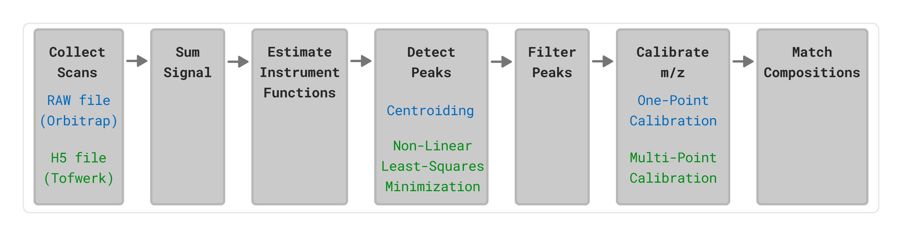

# Overview of the Signal Processing Pipeline

The data processing workflow provides a standardized, instrument-agnostic architectural framework for converting raw mass spectrometry outputs into isotopic assignments.
The architecture branches to accommodate physics-based differences in detector characteristics before converging into a unified downstream storage, matching, and calibration.
This modular layout decouples raw hardware signal acquisition from logical compound identification, enabling flexible integration of new instrument types and calibration strategies without disrupting the core data handling and matching logic.

## Processing Stages and Data Flow

### Signal Aggregation and Summation
The processing begins by loading the continuous profile spectra from vendor files (such as Orbitrap RAW or Tofwerk H5 formats).
To maximize the signal-to-noise ratio for baseline peak extraction, raw signal vectors are accumulated and combined across all temporal scans to construct a single, high-quality aggregate spectrum.

### Empirical Instrument Function Estimation
To account for operational fluctuations and drift, empirical peak shapes and resolution profiles are extracted directly from the experimental spectrum rather than relying on idealized mathematical assumptions.
Detailed methodologies for these calculations are provided in [instrument function documentation](instrument_functions.md).

### Peak Detection
Following instrument characterization, the pipeline executes specialized peak detection routines to extract discrete ion signals from the continuous matrix.
The mathematical implementation of these routines is documented in [peak detection documentation](peak_detection.md).

### Quality Control and Artifact Filtering
To safeguard downstream calibration steps against false or distorted signals, the resolved peak candidates undergo multi-layered quality control filtering.
The exact filters are described in [quality control documentation](peak_detection.md#quality-control-filtering).

### Mass Calibration
The mass calibration corrects systematic mass errors by aligning detected experimental peaks to expected theoretical targets.
The calibration process is detailed in [calibration documentation](calibration.md).

### Isotopic Matching
Stored experimental peaks are aligned against expected theoretical reference patterns to verify chemical composition
The foundational matching rules and assignment criteria are expanded in [matching documentation](matching.md).

